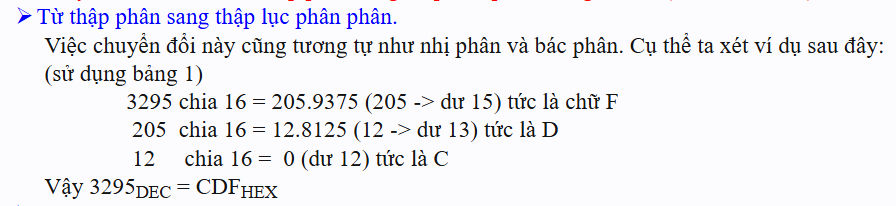

# BIT BYTE MANIPULATION - THAO TÁC BIT BYTE
Chúng ta sẽ cùng tìm hiểu nội dung thao tác với bit byte ở đây. Thứ mà sẽ mang ý nghĩa vô cùng quan trọng, phục vụ các bạn trong quá trình lập trình vi điều khiển.
Nội dung kiến thức:
- Khái niệm bit, byte
- Làm quen với hệ 16, hệ 10, hệ 2
- Cách biểu diễn bit trong vi điều khiển
- Các phép logic với bit

# 1. KHÁI NIỆM
## 1.1 Bit là gì?
- Bit là đơn vị nhỏ nhất để lưu trữ dữ liệu trong máy tính.
- Bit chỉ có 2 giá trị 0 và 1 (Có thể dùng để biểu thị trạng thái: đóng/mở, thấp/cao, sai/đúng,..)
- Tên gọi bit là viết tắt của binary digit (chữ số nhị phân).
- Và nếu mọi người có đọc qua về kiến thức C, thì chắc đã biết được, ngôn ngữ được biên dịch ra cho máy hiểu chính là các chữ số 0 và 1 này.

## 1.2 Byte là gì?
- Byte là tập hợp của 8 bit.
- Một byte có thể biểu diễn 256 giá trị khác nhau (từ 00000000 = 0 đến 11111111 = 255).
- Đây là đơn vị cơ bản để máy tính xử lý dữ liệu (ký tự, màu, số,...).
- Một byte tương ứng với một số nguyên trong khoảng từ 0 đến 255 trong hệ 10.

# 2. LÀM QUEN VỚI CÁC HỆ CHỮ SỐ
Chúng ta sẽ cùng nhau tìm hiểu về cách tính toán cũng như chuyển đổi giữa các hệ với nhau.
## 2.1 Hệ nhị phân
- Hệ nhị phân là hệ chỉ gồm chữ số 0 và 1 như cách đề cập ở trên.
- Lấy ví dụ: 0010 0011 0001 0111. Đây chính là hệ nhị phân.
- Bây giờ cùng tìm hiểu cách tính toán với hệ nhị phân này. Nhưng trước đó, các bạn cần nắm rõ vấn đề này, đó là dù cho là hệ nhị phân, hệ thập lục phân, hệ bát phân, thì chúng đều được quy đổi về một giá trị cố định, độc nhất, chuẩn ở hệ thập phân. Lấy ví dụ:

```cpp
Khi này, có thể thấy rằng đến số 1 ta đã hết số để đi tiếp nên sẽ quay về 0 và tăng chữ số phía trước lên 1, tương tự cho các số phía sau
Nhị phân:   0   1   10  11  100 101
Thập phân:  0   1   3   4   5   6
```

- Cách tính toán để chuyển đổi giữa hệ 2 và hệ 10 đó là:


## 2.2 Hệ thập lục phân (Hệ 16)
- Hệ thập lục phân là hệ gồm 16 kí tự, bao gồm 10 kí tự số và 6 kí tự chữ. Vì độ dài các chữ số chỉ gồm từ 0 đến 9 thôi, nên họ đã chèn thêm các kí tự chữ cái gồm A đến F vào.
- Lấy ví dụ: 7128 AFF8 981D. Đây chính là hệ 16.
- Bây giờ cùng tìm hiểu cách tính toán với hệ 16 này nhé. Tương tự với hệ nhị phân.

```cpp
Thập lục phân:  0   1   2   3   4   5   6   7   8   9   A   B   C   D   E   F   10  11  12
Thập phân:      0   1   2   3   4   5   6   7   8   9   10  11  12  13  14  15  16  17  18
```

- Cách tính toán để chuyển đổi giữa hệ 16 và hệ 10 đó là:




## 2.3 Hệ thập lục phân và Hệ nhị phận
- Có một cách chuyển đổi nhanh giữa hệ 16 và hệ 2. Đó là 1 ký tự trong hệ 16 tương đương với 4 kí tự trong hệ 2.
- Lấy ví dụ: Hệ 16: 3ABF <-> Hệ 2: 0011(3) 1010(A) 1011(B) 1111(F)
- Có một cách tra nhanh là dựa vào bảng sau:


# 3. CÁCH BIỂU DIỄN BIT TRONG VI ĐIỀU KHIỂN
- Trước tiên, nói sơ qua về cách biểu diễn hệ 16 và hệ nhị phân trong datasheet.
  - Hệ 16 sẽ được biểu diễn là 0x****
  - Hệ nhị phận sẽ được biểu diễn là 0b****
- Vậy thì, trong lập trình thanh ghi chắc chắn khi mọi người đọc datasheet sẽ phải làm quen với các địa chỉ thanh ghi hay cách thanh ghi tổ chức dưới dạng các bit như này:


- Đó là cách mà các thanh ghi ghi bit để xác định các chức năng, cũng địa chỉ là các mà chúng ta căn cứ, xác định thanh ghi để mà lập trình. Khi này hẳn sẽ có rất nhiều bạn gặp rắc rối với đọc datasheet cũng như nắm cách các bit, địa chỉ này hoạt động.
- Nhưng mình sẽ làm rõ với các bạn như này, đó là chúng ta cần phân biệt hai khái niệm **"biểu diễn"** và **"giá trị"**.
- Nói rõ hơn, thì việc trình bày địa chỉ, hay tổ chức thanh ghi dưới dạng bit này là một cách **"biểu diễn"** có logic và dễ hệ thống hóa hơn. Nhưng tất cả về bản chất thì chúng nó đều là một **"giá trị"** cụ thể và duy nhất ở hệ 10.
**- Lấy ví dụ:**
  - Ta có địa chỉ PORT GPIOA là 0x4001 0800 (hệ 16), thì giá trị của nó trong hệ 10 là 1073809408. Vậy khi này ta nói ứng với địa chỉ của thanh ghi GPIOA đó chính là giá trị 1073809408 được biểu diễn thành 0x4001 0800 trong hệ 16. Và port A này có địa chỉ kết thúc là 0x4001 0BFF tương ứng với 1073810431 hệ 10. Ta thực hiện phép toán trừ đi 1073810431 - 1073809408 + 1, thì ta nói vùng nhớ của Port GPIOA này chiếm 1024 số tương ứng với 1024 byte hay là độ dời của nó là 0x03FF byte.<br>

  - Lấy ví dụ khác, tương tự cho cấu hình của một thanh ghi, chẳng hạn như thanh ghi GPIOx_CRL nằm trong Port GPIOA, có địa chỉ là từ
  0x4001 - 0x4004, vậy dung lượng của thanh ghi này là 4 byte tương đương với 32 bit, vậy thì ta hoàn toàn có thể biểu diễn nó dạng logic là các bit nhị phân từ bit 0 đến bit 31 như này: 0b0000 0000 0000 0000 0000 0000 0000 0000.Và ta sẽ thao tác với các bit trên đây, mỗi một bit ở các vị trí sẽ có một chức năng cụ thể, chẳng hạn kích hoạt chức năng A là 0b0001 0000 0000 0000 0000 0000 0000 0000
  ; chức năng B là: 0001 0010 0000 0000 0000 0000 0000 0000. Nó sẽ hoạt động như thế, nhưng về bản chất ở thanh ghi này mỗi chức năng đó dù được biểu diễn dưới dạng nhị phân nhưng thực chất là chúng sẽ tương ứng với một con số hệ 10.

  --> Từ 2 ví dụ trên ta sẽ đúc kết được rằng: các địa chỉ, cấu hình thanh ghi, thực chất là một giá trị hệ 10 ở mảng đó. Và giá trị này là duy nhất và được biểu diễn một cách có logic ở các hệ sao cho phù hợp. Ví dụ như ta nói: ***"Biểu diễn địa chỉ thanh ghi - Hệ 16 - Giá trị bắt đầu từ 0 đến 1 tỷ - Mỗi một giá trị tương ứng với một địa chỉ"*** ***"Biểu diễn cấu hình thanh ghi - Hệ 2 - Giá trị từ 0 đến 1 triệu - Mỗi một giá trị tương ứng với 1 chức năng được kích hoạt"***.

# 4. THAO TÁC VỚI BIT
- Sau khi đã tìm hiểu qua về bản chất của bit byte trong vi điều khiển, bây giờ ta hãy cùng tìm hiểu về các phép logic để có thể thao tác bit byte.


