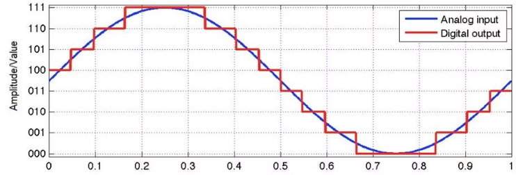

# ADC – Analog to Digital Converter

ADC (Analog to Digital Converter – Bộ chuyển đổi tương tự sang số) là một trong những ngoại vi quan trọng trong các vi điều khiển hiện đại như STM32. Nó cho phép vi điều khiển đọc được các tín hiệu điện áp từ môi trường thực tế (như cảm biến nhiệt độ, ánh sáng, áp suất...) và chuyển đổi thành giá trị số để xử lý trong chương trình.

STM32F1 cung cấp nhiều kênh ADC với độ phân giải 12-bit, hỗ trợ nhiều chế độ hoạt động như đơn kênh, đa kênh, chuyển đổi liên tục (continuous), theo nhóm (scan), hỗ trợ DMA, và có khả năng giám sát tín hiệu thông qua tính năng Analog Watchdog.

Trong tài liệu này, mình sẽ chia sẻ toàn diện về ADC trên STM32F1, đi từ cơ bản đến các kỹ thuật nâng cao, với phong cách giải thích chi tiết, dễ hiểu, từng bước một, giải thích không chỉ "làm gì" mà còn "vì sao phải làm như vậy".

Các nội dung chính bao gồm:

- **Phần 1: Tổng quan về ADC và các khái niệm nền tảng**  
  Giải thích các khái niệm như tín hiệu analog, độ phân giải, tốc độ lấy mẫu, vai trò của ADC trong hệ thống nhúng và sự khác nhau giữa kênh regular và injected.

- **Phần 2: Phân tích, giải thích các khái niệm kỹ thuật**  
  Làm rõ các thanh ghi, thuật ngữ kỹ thuật như align, trigger, ngắt, clock, FSM, flip-flop, watchdog,... tất cả được diễn giải chi tiết từ gốc.

- **Phần 3: Phân tích từng bước hoạt động của ADC**  
  Dựa trên sơ đồ khối của STM32F1, từng bước hoạt động của ADC sẽ được giải thích từ lúc chọn kênh đầu vào đến khi dữ liệu được ghi ra và xử lý.


- **Phần 4: Cấu trúc cấu hình và triển khai**  
  Hướng dẫn cấu hình đầy đủ ADC, DMA, NVIC, analog watchdog... theo từng bước cụ thể và dễ hiểu.


# PHẦN 1: TỔNG QUAN VỀ ADC VÀ CÁC KHÁI NIỆM NỀN TẢNG

Như đã nói trước đó, để có thể hiểu rõ về ADC trong STM32F10x hơn ta nên biết qua về các khái niệm:
- ADC
- Analog
- Thông số ADC trong Vi điều khiển

## 1. ADC là gì?

ADC (Analog to Digital Converter) là một khối ngoại vi chuyên dụng để chuyển tín hiệu analog (liên tục, điện áp thay đổi theo thời gian) thành tín hiệu digital (giá trị số hữu hạn) để MCU có thể xử lý được.

**Ví dụ**: Cảm biến nhiệt LM35 xuất ra mức điện áp tỉ lệ với nhiệt độ. Để đọc được nhiệt độ này, STM32 phải đọc điện áp analog và chuyển sang dạng số.

## 2. Tín hiệu analog là gì? Tại sao cần số hóa?

Tín hiệu analog là tín hiệu thay đổi liên tục theo thời gian (vd: điện áp, dòng điện, nhiệt độ,...). MCU là thiết bị xử lý số, do đó không thể đọc trực tiếp analog mà phải dùng ADC để chuyển đổi.

## 3. ADC trong vi điều khiển STM32F10x

### 3.1 Thông số phần cứng:
- STM32F103C8 có 2 bộ ADC độc lập là **ADC1** và **ADC2**, mỗi bộ hỗ trợ đến **16–18 channel analog** (tùy phiên bản chip và package), chia thành 2 nhóm là **regular** và **injected**.
- Kết quả chuyển đổi được lưu trữ trong thanh ghi 16 bit.
- Độ phân giải 12 bit tương ứng với giá trị maximum là **4095**.
- Điện áp cung cấp cho khối ADC là từ **2.4V đến 3.6V**, thường dùng chung với **VDDA = VDD = 3.3V**.
- Điện áp đầu vào cho kênh ADC phải nằm trong khoảng **2.4V ≤ VIN ≤ 3.6V** (nếu VDDA = 3.3V, thì nên đo trong khoảng 0V → 3.3V).

### 3.2 Tính năng và chế độ hoạt động:
- Có nhiều chế độ hoạt động như: **Single conversion**, **Continuous mode**, **Scan mode**...
- Hỗ trợ **trigger từ timer/ngắt ngoài/phần mềm**.
- Tích hợp **Analog Watchdog** để giám sát điện áp.
- Có thể cấu hình hoạt động độc lập hoặc đồng bộ giữa ADC1 và ADC2.
- Hỗ trợ **calibration tự động** để nâng cao độ chính xác.
- Thời gian chuyển đổi nhanh: **~1us tại tần số 65MHz**.
- Hỗ trợ **DMA** để truyền dữ liệu ADC về bộ nhớ mà không cần CPU xử lý thủ công.


---

# PHẦN 2: PHÂN TÍCH CÁC KHÁI NIỆM CHUYÊN MÔN
Ở phần này, mình sẽ giải thích kĩ hơn các khái niệm liên quan cần biết, các khái niệm sâu hơn bên trong ADC và vi điều khiển.

## 1. CÁC KHÁI NIỆM LIÊN QUAN
- Độ phân giải (Resolution)
- Tần suất lấy mẫu (Sampling Rate)
- Channel
- Nhóm injected và regular
- Xung clock
- Trigger & Ngắt
- Analog Watchdog

### 1.1 Độ phân giải (Resolution)
Độ phân giải cho biết ADC chia khoảng điện áp analog ra bao nhiêu bậc.

STM32F1 dùng ADC 12-bit, tức là chia điện áp từ 0V đến Vref (thường là 3.3V) thành **2^12 = 4096 bậc**. Giống như trong hình bên dưới, thang đó có 3 bit hiển thị, tức là có **2^3 = 8** mức để hiển thị. Vậy thì việc chia sử dụng càng nhiều bit, hay nói cách khác là nhiều mức độ thì độ chính xác sẽ cao hơn rất nhiều.

- Mỗi bậc ước tính: 3.3V / 4096 ≈ 0.805 mV
- Giá trị ADC = (Vinput / Vref) * 4095



### 1.2 Tần suất lấy mẫu (Sampling Rate)
ADC là một bộ chuyển đổi số, vì vậy nó cần phải đọc dữ liệu --> Xử lý dữ liệu --> Trả kết quả. Vậy thì tần suất đọc dữ liệu chính là tần suất mà ADC lấy dữ liệu analog vào để xử lý.<br>

Sampling rate là số lần ADC đọc giá trị analog trong một giây.
- Sampling rate càng cao → dữ liệu chi tiết càng nhiều
- Tuy nhiên, quá cao sẽ gây tăng tải `CPU` hoặc `DMA`

Tốc độ này phụ thuộc vào:
- Xung clock ADC
- Sample time (thời gian lấy mẫu)
- Conversion time (thời gian xử lý)

### 1.3 Channel

Cũng như GPIO, ADC cũng sẽ có các channel. Mỗi bộ ADC (ADC1, ADC2) có thể truy cập đến các channel từ **ADCx_IN0** đến **ADCx_IN17**, tổng cộng 18 kênh. Tuy nhiên có vài lưu ý quan trọng:

- Trong đó có 2 channel đặc biệt:
  - **ADC_IN16**: Cảm biến nhiệt độ tích hợp sẵn trong vi điều khiển (Internal Temperature Sensor)
  - **ADC_IN17**: Điện áp tham chiếu nội (VREFINT – Internal Reference Voltage)

  Hai kênh này không gắn với chân GPIO nào, mà được kết nối nội bộ trong chip. Do đó, **chỉ có 16 channel ADC còn lại là ánh xạ ra chân GPIO** và có thể dùng để đọc tín hiệu ngoài.

- Ngoài ra, **ADC_IN0** là channel dùng chung cho cả ADC1 và ADC2. Trong cùng một thời điểm, chỉ có một ADC có thể truy cập channel này.

Các channel ADC được phân bổ cố định vào các chân GPIO tương ứng. Dưới đây là bảng ánh xạ channel ADC sang các chân GPIO của STM32F103C8T6:

| Channel | Tên kênh ADC | Chân GPIO tương ứng  |
| ------- | ------------ | -------------------- |
| 0       | ADCx_IN0     | PA0                  |
| 1       | ADCx_IN1     | PA1                  |
| 2       | ADCx_IN2     | PA2                  |
| 3       | ADCx_IN3     | PA3                  |
| 4       | ADCx_IN4     | PA4                  |
| 5       | ADCx_IN5     | PA5                  |
| 6       | ADCx_IN6     | PA6                  |
| 7       | ADCx_IN7     | PA7                  |
| 8       | ADCx_IN8     | PB0                  |
| 9       | ADCx_IN9     | PB1                  |
| 10      | ADCx_IN10    | PC0                  |
| 11      | ADCx_IN11    | PC1                  |
| 12      | ADCx_IN12    | PC2                  |
| 13      | ADCx_IN13    | PC3                  |
| 14      | ADCx_IN14    | PC4                  |
| 15      | ADCx_IN15    | PC5                  |
| 16      | ADCx_IN16    | Internal Temp Sensor |
| 17      | ADCx_IN17    | VREFINT              |

Ghi chú:
- Tùy vào phiên bản chip (package), có thể có một số chân không được đưa ra ngoài.
- “ADCx” có thể là ADC1 hoặc ADC2, vì hai bộ này chia sẻ cùng bảng channel.

### 1.4 Nhóm Regular và Injected

STM32 chia các kênh ADC thành 2 nhóm là **Regular** và **Injected**. Hai nhóm này có sự khác biệt rõ rệt về chức năng, cách hoạt động và độ ưu tiên.

#### Bảng so sánh Regular vs Injected:

| Đặc điểm             | Regular Channels                       | Injected Channels                        |
| -------------------- | -------------------------------------- | ---------------------------------------- |
| Số lượng tối đa kênh | 16 kênh                                | 4 kênh                                   |
| Độ ưu tiên           | Thấp hơn                               | Cao hơn – có thể tạm dừng regular để đo  |
| Cách hoạt động       | Theo chuỗi đã lập trình                | Tự kích hoạt đo khi có trigger từ ngoài  |
| Kích hoạt đo         | Bằng phần mềm hoặc trigger             | Chỉ bằng trigger ngoài (timer, EXTI,...) |
| Tính tuần tự         | Đo lần lượt từng kênh theo thứ tự SQRx | Đo từng kênh theo JSQR                   |
| Lưu kết quả          | Lưu vào ADC_DR                         | Lưu vào ADC_JDRx                         |
| Ngắt                 | Có thể tạo ngắt                        | Có thể tạo ngắt riêng                    |
| Ứng dụng             | Đo dữ liệu định kỳ                     | Đo sự kiện bất thường, tức thời          |

---

#### Ứng dụng:

- **Regular channels**: Dùng trong chu trình đo ADC bình thường, theo dõi dữ liệu liên tục. Ví dụ: Đọc điện áp, cảm biến nhiệt độ môi trường, cảm biến độ ẩm, v.v…

- **Injected channels**: Dùng để đo những tín hiệu **quan trọng và đột xuất**, thường đến từ các cảm biến phát hiện lỗi, quá nhiệt, chạm mạch,... Đặc biệt, injected có thể **ngắt quá trình đo của regular ngay lập tức** để thực hiện phép đo của mình → đảm bảo độ ưu tiên cao.

Tức là, ta dùng Regular cho các tín hiệu “bình thường, đo thường xuyên” và Injected cho các tín hiệu “không phải lúc nào cũng xuất hiện, mà một khi đã xuất hiện là vô cùng quan trọng”.

### 1.5 Xung clock – Nguồn sống của các ngoại vi

Cũng giống như GPIO hay các ngoại vi khác, **ADC muốn hoạt động được thì phải được cấp xung clock**. Đây là điều kiện bắt buộc để bất kỳ ngoại vi nào trên vi điều khiển STM32 có thể hoạt động.

#### Vậy xung clock là gì?

**Xung clock (Clock signal)** là một tín hiệu dạng sóng vuông, được tạo ra từ thạch anh (crystal oscillator) hoặc mạch dao động nội (internal oscillator) trong vi điều khiển. Xung clock cung cấp nhịp thời gian chuẩn để **đồng bộ hóa mọi hoạt động của hệ thống**, từ CPU cho đến các ngoại vi như ADC, UART, SPI,...

#### Vì sao cần clock?

Mỗi thao tác trong hệ thống vi điều khiển – như lấy mẫu ADC, truyền dữ liệu UART, hay thực thi một câu lệnh – đều cần được thực hiện theo **một nhịp thời gian xác định**. Nếu không có clock, vi điều khiển sẽ không biết “khi nào” cần thực hiện một hành động → hệ thống sẽ rối loạn hoặc không thể vận hành.

#### Clock đến từ đâu?

- Có thể đến từ **thạch anh ngoài** (External Crystal), cho độ ổn định cao.
- Hoặc từ **bộ tạo dao động nội** (Internal RC Oscillator), thường có sẵn trong vi điều khiển.
- Sau đó, clock này được **chia tần số, định tuyến, phân phối** đến từng phần của hệ thống thông qua hệ thống **bus và bộ chia tần số (prescaler)**.

#### Tần số clock ảnh hưởng thế nào đến hệ thống?

- Tần số clock càng cao → hệ thống xử lý càng nhanh, nhưng tiêu tốn nhiều điện năng hơn.
- Clock cũng ảnh hưởng trực tiếp đến **thời gian chuyển đổi ADC**, vì nó quyết định tốc độ lấy mẫu và xử lý tín hiệu.

### 1.6 Trigger và Ngắt

Trong hệ thống nhúng, việc xử lý tín hiệu ADC một cách hiệu quả là điều quan trọng. Hai cơ chế hỗ trợ quá trình này là **trigger** và **ngắt** – giúp hệ thống đo ADC đúng thời điểm và giảm tải cho CPU.

---

#### 1. Trigger là gì?

Trigger là cơ chế **kích hoạt ADC bắt đầu quá trình đo** khi một sự kiện xác định xảy ra. Sự kiện đó có thể là một tín hiệu timer, sự thay đổi trạng thái chân GPIO, hoặc một điều kiện phần mềm.

#### Nếu không dùng trigger thì sao?

```c
while (1)
{
    ADC_SoftwareStartConv(ADC1);            // Yêu cầu đo
    while (!ADC_ConversionComplete());      // Chờ đo xong
    uint16_t value = ADC_GetValue();        // Đọc giá trị
    delay_ms(10);
}
```

Vấn đề:
- CPU bị chặn trong vòng `while`, không làm gì khác cho đến khi ADC đo xong.
- Khó đảm bảo chính xác thời điểm đo nếu chỉ dùng phần mềm.
- Không phù hợp với các hệ thống cần phản ứng đúng thời điểm (real-time).

**→ Khi đó, cần có trigger để ADC bắt đầu đo vào đúng thời điểm mong muốn.**

#### Đối tượng thực hiện trigger
- **Trigger phần mềm**: gọi bằng lệnh phần mềm (`SWSTART`).
- **Trigger phần cứng**: sử dụng timer để phát tín hiệu (ví dụ: `Timer3_TRGO`).
- **Trigger ngoài**: sử dụng tín hiệu chân EXTI làm nguồn kích hoạt.

#### Ví dụ thực tế cần trigger
- Đo áp suất khi van khí mở.
- Đo điện áp tại thời điểm PWM đang ở mức cao.
- Đo cảm biến nhiệt độ mỗi giây một lần bằng Timer.

Các loại trigger phổ biến:
- Trigger bằng phần mềm (Software Trigger).
- Trigger bằng Timer (Timer TRGO).
- Trigger bằng tín hiệu ngoài (EXTI).

---

#### 2. Ngắt là gì?

Ngắt (Interrupt) là cơ chế cho phép **CPU được thông báo khi quá trình đo ADC hoàn tất**, thay vì phải chờ đợi theo kiểu vòng lặp blocking.

#### Nếu không dùng ngắt:
```c
ADC_SoftwareStartConv();
while (!(ADC1->SR & ADC_SR_EOC)); // Đợi đo xong
```

- CPU bị chặn trong quá trình chờ.
- Không xử lý được các công việc khác đồng thời.

#### Nếu dùng ngắt:
- Khi ADC đo xong, cờ EOC được bật.
- Phần cứng tự động gọi CPU xử lý qua **hàm ngắt** (ISR).
- CPU chỉ tạm dừng công việc chính, xử lý dữ liệu ADC rồi quay lại.

**→ Cách này gọi là xử lý bất đồng bộ (asynchronous), hiệu quả cao trong hệ thống nhúng.**

---

#### Cờ ngắt trong ADC

- `EOC` (End of Conversion): báo hiệu đo xong với regular channel.
- `JEOC` (Injected End of Conversion): báo hiệu đo xong với injected channel.

#### Đối tượng thực hiện ngắt

- **NVIC (Nested Vectored Interrupt Controller)** là khối phần cứng trong vi điều khiển STM32 thực hiện quản lý và ưu tiên các ngắt.
- Có thể sử dụng ngắt ngoài (EXTI) hoặc nội bộ thông qua NVIC để xử lý ngắt ADC.

---

### So sánh vai trò

| Thành phần | Vai trò chính                                                 |
| ---------- | ------------------------------------------------------------- |
| Trigger    | Kích hoạt ADC đo đúng thời điểm (theo sự kiện hoặc thời gian) |
| Ngắt       | Giúp CPU không cần chờ, chỉ xử lý khi ADC đo xong             |

---

#### Tổng kết lợi ích khi kết hợp Trigger + Ngắt

- Đảm bảo thời điểm đo chính xác (theo yêu cầu).
- Không tiêu tốn tài nguyên CPU.
- Đo ADC một cách tự động, hiệu quả, không bị blocking.

---

#### 1.7 Analog Watchdog là gì?

Analog Watchdog là một cơ chế **giám sát điện áp đầu vào ADC** tích hợp sẵn trong phần cứng. Khi giá trị đo vượt ra ngoài phạm vi cấu hình (gồm ngưỡng trên và ngưỡng dưới), ADC sẽ tự động:

- Bật cờ cảnh báo (bit AWD trong thanh ghi `ADC_SR`)
- Kích hoạt ngắt nếu được bật (`AWDIE` trong `ADC_CR1`)

Bạn có thể hình dung Analog Watchdog giống như một hệ thống báo động phần cứng – giúp cảnh báo ngay khi có tín hiệu bất thường.

---

#### Tại sao cần so sánh với ngưỡng?

Trong nhiều ứng dụng thực tế, bạn **không cần đọc liên tục mọi giá trị ADC**, mà chỉ cần phát hiện khi:

- **Điện áp pin quá thấp** → cần cảnh báo người dùng hoặc dừng hệ thống.
- **Áp suất vượt mức an toàn** → cần xả áp hoặc dừng van.
- **Nhiệt độ cao vượt mức giới hạn** → phải tắt động cơ hoặc báo lỗi.

Nhờ đó:
- **Giảm tải cho CPU**: không cần đọc ADC liên tục.
- **Phản ứng nhanh**: vì việc kiểm tra ngưỡng là phần cứng thực hiện ngay khi đo xong.

---

#### Các thanh ghi liên quan

| Thanh ghi | Vai trò mô tả                                                          |
| --------- | ---------------------------------------------------------------------- |
| `ADC_HTR` | High Threshold: ngưỡng trên – nếu ADC > HTR thì kích hoạt báo động.    |
| `ADC_LTR` | Low Threshold: ngưỡng dưới – nếu ADC < LTR thì kích hoạt báo động.     |
| `ADC_CR1` | Bật Watchdog (`AWDEN`) và chọn 1 kênh duy nhất để giám sát (`AWDSGL`). |
| `ADC_SR`  | Chứa cờ `AWD`: được bật khi giá trị đo vượt ngoài ngưỡng cho phép.     |

---

#### Ví dụ cấu hình:

Giả sử bạn cần giám sát điện áp đầu vào trên kênh `ADC_IN5`. Nếu giá trị đo nằm ngoài khoảng 1000–3000, hệ thống sẽ cảnh báo:

```c
ADC1->HTR = 3000;  // Ngưỡng trên
ADC1->LTR = 1000;  // Ngưỡng dưới
ADC1->CR1 |= ADC_CR1_AWDEN | ADC_CR1_AWDSGL | (5 << 0); // Bật AWD, giám sát kênh 5
ADC1->CR1 |= ADC_CR1_AWDIE; // Cho phép ngắt nếu vượt ngưỡng
```

---

### Kết luận tổng hợp

| Mục                       | Giải thích dễ hiểu                                                        |
| ------------------------- | ------------------------------------------------------------------------- |
| Thanh ghi 16-bit          | Dữ liệu ADC 12-bit lưu trong 16-bit để linh hoạt align left/right         |
| Align Left / Right        | Chỉnh vị trí bit dữ liệu trong thanh ghi để tiện xử lý                    |
| NVIC                      | Bộ điều khiển ngắt trung tâm, giúp xử lý bất đồng bộ khi ADC đo xong      |
| Analog Watchdog           | Tính năng giám sát điện áp vượt ngưỡng tích hợp trong phần cứng ADC       |
| So sánh ngưỡng để làm gì? | Để phát hiện nhanh các điều kiện nguy hiểm mà không cần kiểm tra liên tục |


## 2. CÁC KHÁI NIỆM - KIẾN THỨC SÂU VỀ BÊN TRONG VI ĐIỀU KHIỂN
- Hệ thống thanh ghi ADC
- NVIC
- Timer
- DMA

### 2.1 Hệ thống thanh ghi ADC
Dưới đây là danh sách đầy đủ các thanh ghi liên quan đến **ADC trong STM32F1** (ví dụ STM32F103x) – theo Reference Manual của STMicroelectronics:

| Tên thanh ghi  | Địa chỉ offset | Vai trò chính                                                                |
| -------------- | -------------- | ---------------------------------------------------------------------------- |
| `ADC_SR`       | `0x00`         | Status Register – chứa các cờ trạng thái như EOC, JEOC, AWD, JSTRT, STRT     |
| `ADC_CR1`      | `0x04`         | Control Register 1 – cấu hình: watchdog, ngắt, dual mode, scan, ...          |
| `ADC_CR2`      | `0x08`         | Control Register 2 – cấu hình hoạt động ADC: trigger, align, start conv, ... |
| `ADC_SMPR1`    | `0x0C`         | Sample Time Register 1 – cấu hình thời gian mẫu cho kênh ADC 10 đến 17       |
| `ADC_SMPR2`    | `0x10`         | Sample Time Register 2 – cấu hình thời gian mẫu cho kênh ADC 0 đến 9         |
| `ADC_JOFR1..4` | `0x14..0x20`   | Offset cho các injected channel (JOFRx)                                      |
| `ADC_HTR`      | `0x24`         | High Threshold Register – ngưỡng trên của Analog Watchdog                    |
| `ADC_LTR`      | `0x28`         | Low Threshold Register – ngưỡng dưới của Analog Watchdog                     |
| `ADC_SQR1`     | `0x2C`         | Regular Sequence Register 1 – xác định độ dài chuỗi và các kênh SQ13–SQ16    |
| `ADC_SQR2`     | `0x30`         | Regular Sequence Register 2 – chứa kênh SQ7–SQ12                             |
| `ADC_SQR3`     | `0x34`         | Regular Sequence Register 3 – chứa kênh SQ1–SQ6                              |
| `ADC_JSQR`     | `0x38`         | Injected Sequence Register – chọn kênh cho injected                          |
| `ADC_JDR1..4`  | `0x3C..0x48`   | Kết quả chuyển đổi của các injected channel                                  |
| `ADC_DR`       | `0x4C`         | Data Register – chứa kết quả chuyển đổi của regular channel                  |

Để mà phân tích từng thanh ghi thì sẽ khá tốn thời gian nên mình sẽ phân tích các thanh ghi chính:

#### Thanh ghi SQRx
Đây sẽ là thanh ghi giúp chọn channel ADC cho kênh SQ. Tức là ta có thể yêu cầu ADC đo một lúc nhiều channel ADC_IN5, ADC_IN10,..

Và kênh SQx này là một dãy thứ tự từ SQ1 đến SQ16 mà ta sẽ sắp xếp các channel ADC vào theo thứ tự đó.

Lấy ví dụ tôi muốn đo một lúc 3 channel ADC. Thì khi này tôi sẽ có 3 kênh SQ1, SQ2, SQ3 và tôi muốn dùng đo theo thứ tự là ADC_IN5 rồi tới ADC_IN10 rồi tới ADC_IN11, thì khi này tôi sẽ chọn các kênh tương ứng là SQ1 = 5 (ADC_IN5), SQ2 = 10 (ADC_IN10), SQ3 = 11 (ADC_IN11).

Trong đó, thanh ghi SQR1 sẽ giúp xác định số SQ hay số kênh ADC mà ta muốn đo. Và quản lý kênh SQ từ SQ13 đến SQ16. Tương tự SQR2 sẽ quản lý các kênh SQ từ SQ7 đến SQ12. Tương tự cho SQR3.

Lấy ví dụ:

```cpp

ADC1->SQR1 = (2 << 20);        // L[3:0] = 2 → đo 3 kênh (0=1ch, 1=2ch, 2=3ch)
ADC1->SQR3 = (3 << 0) |        // SQ1 = channel 3
              (5 << 5) |       // SQ2 = channel 5
              (10 << 10);      // SQ3 = channel 10

```

#### Thanh ghi SR
Thanh ghi SR sẽ quản lý các cờ tín hiệu, các cờ này sẽ được ADC tự động đặt trong quá trình hoạt động. Chúng ta sẽ chỉ cần kiểm tra.

Dưới đây là bảng tổng hợp các cờ quan trọng trong thanh ghi `ADC_SR`, giúp bạn giám sát quá trình hoạt động của ADC.

| Cờ    | Tên đầy đủ                 | Khi nào được set?                        | Ý nghĩa và ứng dụng                                                    |
| ----- | -------------------------- | ---------------------------------------- | ---------------------------------------------------------------------- |
| EOC   | End of Conversion          | Khi quá trình đo **regular** kết thúc    | Báo rằng ADC đã đo xong và kết quả sẵn sàng trong `ADC_DR`             |
| JEOC  | Injected End of Conversion | Khi quá trình đo **injected** kết thúc   | Báo rằng ADC đã đo xong injected channel, dữ liệu nằm trong `ADC_JDRx` |
| AWD   | Analog Watchdog            | Khi giá trị ADC vượt ngưỡng HTR hoặc LTR | Cảnh báo tín hiệu ADC nằm ngoài vùng an toàn                           |
| JSTRT | Injected Start             | Khi quá trình đo injected bắt đầu        | Kiểm tra ADC injected đang hoạt động                                   |
| STRT  | Start                      | Khi quá trình đo regular bắt đầu         | Kiểm tra ADC regular đang hoạt động                                    |

---

#### Giải thích chi tiết

- **EOC (End of Conversion):** Đây là cờ phổ biến nhất, dùng để báo hiệu rằng dữ liệu đã sẵn sàng trong `ADC_DR`. Bạn có thể dùng trong polling (`while (!EOC)`), hoặc ngắt.

- **JEOC (Injected End of Conversion):** Tương tự EOC, nhưng dành riêng cho nhóm injected.

- **AWD (Analog Watchdog):** Rất hữu ích trong hệ thống cần cảnh báo điện áp ra khỏi ngưỡng. Cờ này được kích khi kết quả ADC vượt ngưỡng `HTR` hoặc thấp hơn `LTR`.

- **STRT / JSTRT:** Cờ này giúp bạn xác định quá trình đo đã thực sự bắt đầu chưa (đặc biệt hữu ích khi sử dụng trigger).
---

#### Ghi chú sử dụng

- Trong **chế độ ngắt**, các cờ này thường được kiểm tra trong hàm xử lý ngắt (ISR).
- Để **clear** các cờ này, chỉ cần ghi `1` vào đúng bit đó trong `ADC_SR`.

#### Thanh ghi CRx

Thanh ghi CRx bao gồm `ADC_CR1` và `ADC_CR2`, là các thanh ghi điều khiển chính trong hoạt động của ADC.

- `ADC_CR1` (Control Register 1):

  - Cấu hình watchdog (AWDEN, AWDIE, AWDSGL).
  - Kích hoạt scan mode (SCAN).
  - Kích hoạt interrupt (EOCIE, JEOCIE).
  - Thiết lập chế độ dual mode (DUALMOD).

- `ADC_CR2` (Control Register 2):

  - Bật ADC (ADON).
  - Chọn trigger source cho regular và injected.
  - Bật DMA (DMA).
  - Bật chế độ continuous (CONT).
  - Cấu hình align dữ liệu (ALIGN).
  - Bắt đầu chuyển đổi bằng phần mềm (SWSTART, JSWSTART).

#### Thanh ghi SMPRx

Thanh ghi SMPRx gồm `ADC_SMPR1` và `ADC_SMPR2`, dùng để cấu hình thời gian lấy mẫu (sampling time) cho từng kênh ADC.

- `ADC_SMPR1`: Cấu hình thời gian lấy mẫu cho các kênh ADC từ 10 đến 17.
- `ADC_SMPR2`: Cấu hình thời gian lấy mẫu cho các kênh ADC từ 0 đến 9.

Mỗi kênh có thể được cấu hình thời gian lấy mẫu khác nhau, với các giá trị như: 1.5, 7.5, 13.5, 28.5, 41.5, 55.5, 71.5, 239.5 chu kỳ clock.

Tại sao cần điều chỉnh thời gian lấy mẫu?

- Các cảm biến có trở kháng cao (high impedance) cần thời gian lấy mẫu dài để tín hiệu ổn định.
- Với tín hiệu thay đổi nhanh, chọn thời gian lấy mẫu ngắn để bắt kịp tín hiệu.

```cpp
ADC1->SMPR2 |= (ADC_SampleTime_71Cycles5 << ADC_Channel_5*3); // Cấu hình channel 5 lấy mẫu trong 71.5 chu kỳ
```

#### Thanh ghi DR

Đây là thanh ghi chứa kết quả chuyển đổi của kênh regular sau khi ADC thực hiện đo xong. Mỗi lần ADC đo xong 1 kênh (regular), kết quả sẽ được ghi vào thanh ghi ADC_DR.

Đây là thanh ghi 16-bit (uint16_t), dù độ phân giải ADC thường là 12-bit.

Dữ liệu sẽ nằm ở 12 bit thấp, còn lại 4 bit trên phụ thuộc vào cấu hình align.

#### **Tại sao lại là 16-bit trong khi ADC chỉ 12-bit?**

Dữ liệu ADC có độ phân giải 12-bit (tức giá trị từ 0 → 4095).

Nhưng vi điều khiển thường đọc dữ liệu theo từng byte (8-bit) hoặc word (16-bit) để tăng tốc độ và dễ thao tác.

Vì vậy, dữ liệu được lưu trong thanh ghi 16-bit, dù chỉ cần 12 bit là đủ.

Điều này giúp đảm bảo truy xuất dữ liệu đơn giản: chỉ cần đọc 1 lần 16-bit là có đủ giá trị ADC.

#### **Căn lề dữ liệu – Align Left vs Right**

Dữ liệu 12-bit có thể được đặt vào trong thanh ghi 16-bit theo 2 kiểu căn lề (align):

| Căn lề           | Mô tả                                                        | Ví dụ (giá trị 0x0ABC = 2748) |
| ---------------- | ------------------------------------------------------------ | ----------------------------- |
| Right (mặc định) | Dữ liệu nằm ở 12 bit thấp ([11:0]), 4 bit cao [15:12] = 0    | ADC_DR = 0x0ABC               |
| Left             | Dữ liệu được dịch sang trái, nằm ở bit [15:4], còn [3:0] = 0 | ADC_DR = 0xABC0               |

Căn lề được cấu hình trong CR2 bằng bit ALIGN:

- ALIGN = 0 → Right
- ALIGN = 1 → Left

Việc chọn align phụ thuộc vào nhu cầu xử lý:

- Nếu muốn lấy trực tiếp giá trị ADC → nên dùng right align (dễ thao tác).
- Nếu muốn lấy bit cao nhất (MSB) để xử lý nhanh (ví dụ: chỉ cần 8-bit đầu) → dùng left align.

#### Thanh ghi JDRx

Tương tự như ADC_DR, thanh ghi ADC_JDRx chứa kết quả đo của các kênh injected.

Có 4 thanh ghi: ADC_JDR1, ADC_JDR2, ADC_JDR3, ADC_JDR4 – tương ứng với 4 injected channel tối đa.

Mỗi thanh ghi là 16-bit, chứa kết quả 12-bit đã được căn chỉnh theo cấu hình align.

Kết quả của các lần đo injected sẽ được lưu vào từng JDRx theo thứ tự đã cấu hình trong JSQR.

Ví dụ sử dụng:

```c
// Đọc giá trị ADC regular
uint16_t adc_value = ADC1->DR;  // kết quả từ channel SQx

// Đọc giá trị injected channel thứ nhất
uint16_t injected_value = ADC1->JDR1;
```

| Thanh ghi | Kết quả của...   | Độ rộng | Căn lề      | Khi nào được cập nhật?                 |
| --------- | ---------------- | ------- | ----------- | -------------------------------------- |
| ADC_DR    | Regular channel  | 16-bit  | ALIGN (CR2) | Khi đo xong 1 lần regular (EOC = 1)    |
| ADC_JDRx  | Injected channel | 16-bit  | ALIGN (CR2) | Khi đo xong 1 kênh injected (JEOC = 1) |


## 2.2 NVIC

**NVIC** (Nested Vector Interrupt Controller) là bộ điều khiển ngắt trung tâm trong vi điều khiển ARM Cortex-M.

### Chức năng chính của NVIC:
- Quản lý các ngắt (interrupt) trong hệ thống.
- Xác định độ ưu tiên của từng ngắt (priority).
- Cho phép hoặc vô hiệu hóa từng ngắt cụ thể.
- Hỗ trợ hệ thống ngắt lồng nhau (nested interrupt), cho phép ngắt có độ ưu tiên cao hơn có thể ngắt các xử lý đang diễn ra.

### Cấu hình NVIC gồm:
- Lựa chọn kênh ngắt (IRQ channel) tương ứng với ngoại vi cần xử lý.
- Thiết lập mức ưu tiên cho từng ngắt (preemption priority và subpriority).
- Kích hoạt ngắt thông qua hàm `NVIC_EnableIRQ()`.

### Vai trò trong hệ thống:
NVIC giúp hệ thống xử lý ngắt một cách hiệu quả và phản ứng nhanh với các sự kiện từ ngoại vi như Timer, ADC, USART, EXTI,...

---

## 2.3 Timer

**Timer** là một phần tử ngoại vi của vi điều khiển dùng để đo thời gian, tạo độ trễ hoặc phát xung điều khiển.

### Chức năng chính của Timer:
- Tạo ngắt định kỳ sau một khoảng thời gian cố định (dùng trong task scheduler).
- Đo độ rộng xung (input capture), tạo PWM (output compare).
- Làm thời gian trễ (delay) chính xác không phụ thuộc vào vòng lặp CPU.

### Cấu hình của Timer bao gồm:
- Chọn clock nguồn cho Timer.
- Thiết lập giá trị Prescaler để chia tần số clock.
- Thiết lập giá trị Auto Reload (ARR) để định nghĩa chu kỳ đếm.
- Bật Timer và enable ngắt nếu cần.

Nội dung sâu hơn về Timer mọi người có thể đọc ở đây [PWM](../PWM/PWM.md).

---

## 2.4 DMA

**DMA** (Direct Memory Access) là cơ chế cho phép truyền dữ liệu giữa bộ nhớ và ngoại vi mà không cần CPU can thiệp. Hay nói cách khác là khi lấy dữ liệu và lưu trữ dữ liệu ta đều phải qua một khâu copy dữ liệu của CPU để tới RAM. Nhưng DMA sẽ giúp ta đưa dữ liệu trực tiếp đến RAM mà không thông qua CPU giúp tiết kiệm hiệu năng cho CPU.

### Chức năng chính của DMA:
- Truyền dữ liệu từ bộ nhớ đến bộ nhớ (mem-to-mem).
- Truyền dữ liệu từ bộ nhớ đến ngoại vi hoặc ngược lại (mem-to-periph, periph-to-mem).
- Giảm tải cho CPU, đặc biệt trong các tác vụ cần truyền khối lượng lớn dữ liệu như ADC, SPI, USART...

### Cấu hình DMA bao gồm:
- Chọn kênh DMA tương ứng với ngoại vi.
- Cấu hình địa chỉ nguồn và đích (SRC, DEST).
- Cấu hình độ dài dữ liệu truyền.
- Chế độ hoạt động: Normal, Circular, hoặc Burst.
- Bật DMA và enable ngắt nếu cần.

Nội dung về DMA này mọi người có thể đọc kỹ hơn ở đây [DMA](../DMA/DMA.md).

# PHẦN 3: PHÂN TÍCH TỪNG BƯỚC HOẠT ĐỘNG CỦA ADC 

1. MCU cấp clock cho ADC, khối ADC bắt đầu hoạt động
2. Cấu hình nguồn đầu vào (MUX, kênh, REFINT...)
3. Chờ trigger từ Timer / EXTI / phần mềm
4. Quá trình sample & hold diễn ra
5. ADC chuyển đổi analog → digital (12-bit)
6. Kết quả ghi vào thanh ghi dữ liệu
7. ADC phát cờ ngắt (nếu bật)
8. Xử lý kết quả (CPU hoặc DMA)

## Bước 1: Cấu hình và chọn nguồn tín hiệu đầu vào

**Công việc gì?**  
Chọn các kênh đầu vào ADC: ADCx_IN0 → ADCx_IN15, cảm biến nhiệt độ, V<sub>REFINT</sub>.  
Lựa chọn giữa nhóm regular và nhóm injected.

**Đối tượng nào làm?**  
Người dùng (lập trình viên) cấu hình qua thanh ghi ADC_SQRx, ADC_JSQR, ADC_CR1, ADC_CR2, ADC_SMPRx.

**Giải thích:**  
Các chân tín hiệu analog được đưa qua Analog MUX → định tuyến vào Injected Channels hoặc Regular Channels.

## Bước 2: Chọn trigger để bắt đầu chuyển đổi

**Công việc gì?**  
Chọn kiểu kích hoạt chuyển đổi: phần mềm hoặc phần cứng (trigger từ timer hoặc chân ngoài).  
Có thể chọn cho cả nhóm regular và injected.

**Đối tượng nào làm?**  
Người dùng cấu hình trigger trong các thanh ghi như EXTSEL, JEXTSEL, EXTTRIG, JEXTTRIG.

**Giải thích:**  
Trigger phần cứng lấy từ timer: TIM1_TRGO, TIM3_CH4…  
Trigger phần mềm được kích hoạt thủ công bằng phần mềm (SWSTART bit).

## Bước 3: Chuyển đổi tín hiệu analog sang digital

**Công việc gì?**  
Sau khi trigger, ADC tiến hành lấy mẫu (sample & hold) và chuyển đổi.  
Tín hiệu được xử lý bởi khối Analog-to-Digital Converter.

**Đối tượng nào làm?**  
Bản thân khối ADC thực hiện quá trình chuyển đổi.

**Giải thích:**  
Dưới xung nhịp ADCCLK, tín hiệu analog được số hóa thành dữ liệu nhị phân.  
ADC dùng độ phân giải 12-bit, lưu vào thanh ghi 16-bit.

## Bước 4: Lưu kết quả vào thanh ghi dữ liệu

**Công việc gì?**  
Kết quả chuyển đổi được ghi vào:  
- ADC_DR cho nhóm regular  
- ADC_JDRx cho nhóm injected

**Đối tượng nào làm?**  
Khối ADC tự động ghi vào các thanh ghi dữ liệu.

**Giải thích:**  
Người dùng có thể đọc trực tiếp giá trị từ ADC_DR hoặc dùng DMA để tự động lấy dữ liệu.

## Bước 5: Cờ trạng thái và ngắt

**Công việc gì?**  
Đặt các cờ báo hiệu hoàn tất chuyển đổi (EOC, JEOC).  
Gọi ngắt nếu được kích hoạt (EOCIE, JEOCIE).

**Đối tượng nào làm?**  
ADC tự đặt cờ, và NVIC xử lý ngắt nếu được bật.

**Giải thích:**  
Cho phép xử lý bất đồng bộ (không cần chờ polling).

## (Tùy chọn) Bước 6: Kiểm tra giá trị ngưỡng – Analog Watchdog

**Công việc gì?**  
So sánh giá trị ADC với các ngưỡng High threshold và Low threshold.  
Kích hoạt cờ cảnh báo AWD nếu vượt ngoài vùng cho phép.

**Đối tượng nào làm?**  
Bên trong khối Analog Watchdog của ADC.

**Giải thích:**  
Dùng để phát hiện lỗi hoặc giá trị vượt ngưỡng (ví dụ: điện áp pin quá thấp).

## (Tùy chọn) Bước 7: Sử dụng DMA để truyền dữ liệu

**Công việc gì?**  
Gửi kết quả ADC đến bộ nhớ mà không cần CPU can thiệp.

**Đối tượng nào làm?**  
Khối DMA tự động truy xuất ADC_DR theo yêu cầu từ ADC.

**Giải thích:**  
Tăng hiệu suất, dùng trong các ứng dụng như đo liên tục nhiều kênh.

## Tổng kết dạng bảng:

| Bước | Công việc                       | Đối tượng nào làm  | Giải thích                                               |
| ---- | ------------------------------- | ------------------ | -------------------------------------------------------- |
| 1    | Chọn tín hiệu đầu vào           | Người dùng         | Chọn kênh analog từ GPIO, sensor, VREFINT                |
| 2    | Kích hoạt chuyển đổi            | Người dùng + Timer | Chọn trigger từ timer hoặc phần mềm                      |
| 3    | ADC chuyển đổi analog → digital | ADC                | Dưới xung ADCCLK, tín hiệu được số hóa                   |
| 4    | Lưu kết quả vào thanh ghi       | ADC                | Ghi vào ADC_DR (regular) hoặc JDRx (injected)            |
| 5    | Đặt cờ trạng thái / ngắt        | ADC + NVIC         | Cờ EOC, JEOC báo hoàn tất, nếu bật ngắt sẽ gọi ISR       |
| 6    | So sánh giá trị với ngưỡng      | Analog Watchdog    | Phát hiện bất thường, kích hoạt cảnh báo nếu vượt ngưỡng |
| 7    | Tự động truyền dữ liệu (DMA)    | DMA                | Gửi giá trị ADC đến bộ nhớ không cần CPU can thiệp       |


# PHẦN 4: CẤU TRÚC CẤU HÌNH TRIỂN KHAI

Các bước để triển khai ADC:

- Bước 1: Cấp xung clock cho GPIO, ADC, Timer (nếu dùng trigger)
- Bước 2: Cấu hình GPIO
- Bước 3: Cấu hình ADC
- Bước 4 (Optional): Cấu hình Timer nếu dùng trigger bằng timer
- Bước 5 (Optional): Cấu hình NVIC nếu dùng ngắt
- Bước 6: Khởi động ADC và bắt đầu chuyển đổi

---

## Cấu hình GPIO

Tùy vào kênh ADC bạn chọn (ví dụ: ADC1_IN0 → GPIOA Pin 0), bạn cần cấu hình chân đó là **Analog mode**.

Ví dụ: Cấu hình GPIOA Pin 0 là analog:

```c
RCC_APB2PeriphClockCmd(RCC_APB2Periph_GPIOA, ENABLE);

GPIO_InitTypeDef GPIO_InitStructure;
GPIO_InitStructure.GPIO_Pin = GPIO_Pin_0;
GPIO_InitStructure.GPIO_Mode = GPIO_Mode_AIN;
GPIO_Init(GPIOA, &GPIO_InitStructure);
```

---

## Cấu hình ADC

### 1. Bật Clock cho ADC

```c
RCC_APB2PeriphClockCmd(RCC_APB2Periph_ADC1, ENABLE);
```

### 2. Cấu hình ADC cơ bản

```c
ADC_InitTypeDef ADC_InitStructure;
ADC_InitStructure.ADC_Mode = ADC_Mode_Independent;
ADC_InitStructure.ADC_ScanConvMode = DISABLE;
ADC_InitStructure.ADC_ContinuousConvMode = ENABLE;
ADC_InitStructure.ADC_ExternalTrigConv = ADC_ExternalTrigConv_None;
ADC_InitStructure.ADC_DataAlign = ADC_DataAlign_Right;
ADC_InitStructure.ADC_NbrOfChannel = 1;
ADC_Init(ADC1, &ADC_InitStructure);
```

Dưới đây là bảng mô tả **các lựa chọn cấu hình cơ bản của ADC** thông qua struct `ADC_InitTypeDef` trong STM32F1, giúp bạn hiểu rõ từng thành phần, giá trị và ý nghĩa của chúng:

## Bảng mô tả cấu hình ADC

| Trường cấu hình          | Giá trị khả dụng                              | Ý nghĩa                                                                                     |
| ------------------------ | --------------------------------------------- | ------------------------------------------------------------------------------------------- |
| `ADC_Mode`               | `ADC_Mode_Independent`                        | ADC hoạt động độc lập. Đây là chế độ phổ biến nhất cho ADC đơn lẻ.                          |
|                          | `ADC_Mode_RegInjecSimult`                     | Regular và Injected đo cùng lúc (chỉ dùng khi có nhiều ADC).                                |
|                          | `ADC_Mode_InjecSimult_FastInterl`, v.v.       | Các mode dùng khi có **2 ADC** hoạt động song song (ADC1 & ADC2) – cho ứng dụng tốc độ cao. |
| `ADC_ScanConvMode`       | `ENABLE`                                      | Cho phép quét nhiều kênh ADC trong 1 lần convert (cần cấu hình SQRx nhiều kênh).            |
|                          | `DISABLE`                                     | Chỉ đo 1 kênh.                                                                              |
| `ADC_ContinuousConvMode` | `ENABLE`                                      | ADC sẽ liên tục convert sau mỗi lần đo xong – thường dùng cho đo liên tục.                  |
|                          | `DISABLE`                                     | Chỉ đo 1 lần khi được trigger hoặc gọi bằng phần mềm.                                       |
| `ADC_ExternalTrigConv`   | `ADC_ExternalTrigConv_T1_CC1`, `T2_CC2`, v.v. | Chọn nguồn trigger từ timer cụ thể (TIMx_CHy, TIMx_TRGO, EXTI, ...) để bắt đầu chuyển đổi.  |
|                          | `ADC_ExternalTrigConv_None`                   | Không dùng trigger ngoài, dùng phần mềm gọi thủ công (`SWSTART`).                           |
| `ADC_DataAlign`          | `ADC_DataAlign_Right`                         | Kết quả convert căn phải trong thanh ghi `ADC_DR`.                                          |
|                          | `ADC_DataAlign_Left`                          | Kết quả dịch trái sang bit cao trong `ADC_DR`.                                              |
| `ADC_NbrOfChannel`       | Số nguyên từ 1–16                             | Số lượng kênh ADC cần đo trong 1 chuỗi (tương ứng số SQx trong SQRx).                       |

---

## Gợi ý thực tế

- Nếu bạn chỉ đo 1 tín hiệu đơn → `ScanConvMode = DISABLE`, `NbrOfChannel = 1`.
- Nếu đo nhiều cảm biến → `ScanConvMode = ENABLE`, `NbrOfChannel = số kênh`, cấu hình thêm `SQRx`.
- Nếu dùng trigger từ timer (ví dụ lấy mẫu đều đặn 1ms) → dùng `ExternalTrigConv = ADC_ExternalTrigConv_T3_TRGO` (chẳng hạn).

### 3. Chọn kênh ADC cần đo

Khi sử dụng ADC trong STM32, sau khi đã cấu hình ADC cơ bản, bước tiếp theo là chọn **kênh ADC cần đo**. STM32 cho phép đo 1 hoặc nhiều kênh, sắp xếp theo trật tự từ SQ1 đến SQ16.

Việc chọn kênh và đặt vào dãy chuyển đổi (conversion sequence) được thực hiện qua hàm:

```c
ADC_RegularChannelConfig(ADC1, ADC_Channel_0, 1, ADC_SampleTime_55Cycles5);
```

#### Cấu trúc và ý nghĩa tham số

| Tham số            | Vai trò                                | Lựa chọn / Giải thích                                                                         |
| ------------------ | -------------------------------------- | --------------------------------------------------------------------------------------------- |
| `ADC1`             | Bộ ADC sử dụng                         | ADC1, ADC2 (STM32F103)                                                                        |
| `ADC_Channel_x`    | Channel cần đo (ADC\_INx)              | Từ `ADC_Channel_0` đến `ADC_Channel_17`, hoặc `ADC_Channel_TempSensor`, `ADC_Channel_Vrefint` |
| `Rank`             | Vị trí trong chuỗi chuyển đổi (1→16)   | Mà kênh sẽ được chuyển đổi theo thứ tự tương ứng SQ1 → SQ16                                   |
| `ADC_SampleTime_x` | Thời gian lấy mẫu trước khi chuyển đổi | `1.5`, `7.5`, ..., `239.5` chu kỳ clock ADC                                                   |

#### Ghi chú:

- Mỗi channel đều phải được khai báo và gán vị trí trong chuỗi.
- Thời gian lấy mẫu càng dài → kết quả càng đối với tín hiệu trở cao.

#### Ví dụ:

Đo liên tiếp 3 kênh ADC: IN3, IN5, IN10:

```c
ADC_RegularChannelConfig(ADC1, ADC_Channel_3, 1, ADC_SampleTime_55Cycles5);
ADC_RegularChannelConfig(ADC1, ADC_Channel_5, 2, ADC_SampleTime_55Cycles5);
ADC_RegularChannelConfig(ADC1, ADC_Channel_10, 3, ADC_SampleTime_55Cycles5);
```

---

### 4. Bật ADC và thực hiện hiệu chuẩn (Calibration)

Trước khi đo, cần:

- Bật ADC
- Thực hiện reset calibration
- Thực hiện hiệu chuẩn (calibration)

```c
ADC_Cmd(ADC1, ENABLE); // Bật ADC

ADC_ResetCalibration(ADC1); // Reset
while(ADC_GetResetCalibrationStatus(ADC1)); // Đợi xong

ADC_StartCalibration(ADC1); // Bắt đầu hiệu chuẩn
while(ADC_GetCalibrationStatus(ADC1)); // Đợi hoàn thành
```

#### Tại sao cần calibration?

| Mục đích                   | Giải thích                                                     |
| -------------------------- | -------------------------------------------------------------- |
| Loại bỏ sai số của ADC     | Sai số do linh kiện analog bên trong chip                      |
| Cải thiện độ chính xác     | Hiệu chuẩn giúp kết quả ADC ổn định và ít bị nhiễu hơn         |
| Bắt buộc sau khi reset ADC | Mỗi khi reset chip hoặc khởi động lại thì phải calibration lại |

---

## (Optional) Cấu hình Timer nếu dùng trigger

Bạn cần cấu hình TIM1 hoặc TIM3 để tạo tín hiệu trigger thông qua chân TRGO.

```c
// Ví dụ: TIM1_TRGO làm trigger ADC
ADC_ExternalTrigConvCmd(ADC1, ENABLE);
ADC_InitStructure.ADC_ExternalTrigConv = ADC_ExternalTrigConv_T1_TRGO;
```

---

## (Optional) Cấu hình NVIC nếu dùng ngắt

```c
NVIC_InitTypeDef NVIC_InitStructure;
NVIC_InitStructure.NVIC_IRQChannel = ADC1_2_IRQn;
NVIC_InitStructure.NVIC_IRQChannelPreemptionPriority = 0;
NVIC_InitStructure.NVIC_IRQChannelSubPriority = 0;
NVIC_InitStructure.NVIC_IRQChannelCmd = ENABLE;
NVIC_Init(&NVIC_InitStructure);

ADC_ITConfig(ADC1, ADC_IT_EOC, ENABLE);
```

Các bạn có thể tìm hiểu kỹ hơn về ngắt ở đây [Interrupt](../INTERRUPT/Interrupt.md)

---

### 5. Bắt đầu chuyển đổi và đọc giá trị ADC

Sau khi đã khai báo kênh và hiệu chuẩn xong, ta bắt đầu đo ADC.

#### Trường hợp 1 kênh regular (không scan mode):

```c
ADC_SoftwareStartConvCmd(ADC1, ENABLE);
while (!ADC_GetFlagStatus(ADC1, ADC_FLAG_EOC));
uint16_t value = ADC_GetConversionValue(ADC1);
```

#### Trường hợp đo nhiều kênh (scan mode):

Khi đã cấu hình ADC\_ScanConvMode = ENABLE, ADC sẽ lần lượt đo các kênh SQ1 → SQx theo số lượng khai báo.

Khi đo xong toàn bộ sequence, ADC\_FLAG\_EOC sẽ được set.

Sau đó, có thể:

- Đọc ADC1->DR ngay sau mỗi lần EOC
- Hoặc dùng DMA để chuyển toàn bộ dữ liệu vào RAM

#### Ví dụ đo 3 kênh, dùng polling:

```c
for (int i = 0; i < 3; i++) {
    ADC_SoftwareStartConvCmd(ADC1, ENABLE);
    while (!ADC_GetFlagStatus(ADC1, ADC_FLAG_EOC));
    buffer[i] = ADC_GetConversionValue(ADC1);
}
```

> Để tối ưu hoá, nên sử dụng DMA khi đo nhiều kênh.

---

Trên đây là quy trình hoàn chỉnh từ cài đặt đến đọc giá trị ADC trong STM32 SPL.
