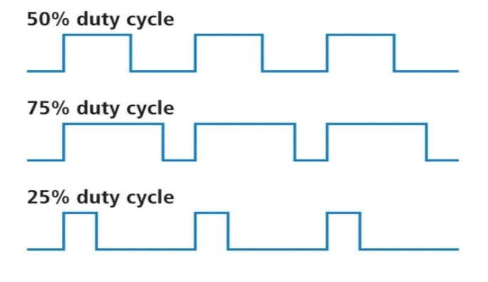

# PWM - PULSE WIDTH MODULATION
PWM (Pulse Width Modulation – điều chế độ rộng xung) là một kỹ thuật cực kỳ phổ biến và quan trọng trong lập trình vi điều khiển. Từ điều chỉnh độ sáng LED, điều khiển tốc độ động cơ, đến tạo tín hiệu điều khiển servo hay phát âm thanh, PWM gần như xuất hiện trong mọi hệ thống nhúng có tính điều khiển.

Việc hiểu rõ cơ chế hoạt động và cách cấu hình PWM không chỉ giúp lập trình viên tận dụng được sức mạnh phần cứng của vi điều khiển, mà còn mở ra khả năng điều khiển thiết bị một cách chính xác, mượt mà và hiệu quả.

Trong tài liệu này, chúng ta sẽ lần lượt tìm hiểu các nội dung sau:

- **Phần 1 – Giới thiệu về PWM**  
  Giải thích khái niệm PWM, duty cycle, nguyên lý điều chế, và các ứng dụng phổ biến.

- **Phần 2 – Cơ chế tạo PWM trên STM32**  
  Phân tích cách PWM được tạo ra từ Timer trên STM32: bộ đếm (CNT), thanh ghi ARR, CCR, PSC, và chế độ OCxM.

- **Phần 3 – Chi tiết các thanh ghi PWM**  
  Trình bày vai trò cụ thể của từng thanh ghi như PSC, ARR, CCR, CNT, CCMRx, CCER, CR1... trong quá trình tạo và điều khiển PWM.

- **Phần 4 – Quy trình cấu hình PWM từng bước**  
  Hướng dẫn từng bước để cấu hình PWM bằng thư viện STM32 Standard Peripheral Library (SPL), từ bật clock đến cấu hình chế độ PWM.

- **Phần 5 – Ứng dụng cơ bản của PWM**  
  Triển khai PWM vào các bài toán thực tế như điều khiển LED, motor DC, buzzer, servo, và điều chỉnh duty bằng giá trị từ ADC.

- **Phần 6 – Ứng dụng PWM nâng cao**  
  PWM nhiều kênh, PWM có ngắt, tạo tín hiệu dạng xung động học, complementary PWM (PWM bù), điều chế công suất cao...

Tài liệu sẽ được trình bày theo hướng phân tích kỹ lưỡng, dễ hiểu và đầy đủ – giúp bạn không chỉ biết cấu hình PWM, mà còn hiểu rõ **tận gốc cách nó hoạt động** và **cách áp dụng nó linh hoạt trong các ứng dụng nhúng thực tế**.


# 1. Giới thiệu về PWM (Pulse Width Modulation)

## 1.1. PWM là gì?

**PWM** (Pulse Width Modulation – Điều chế độ rộng xung) là một kỹ thuật điều khiển tín hiệu số bằng cách tạo ra một chuỗi **xung vuông có độ rộng thay đổi được**, trong khi **tần số giữ nguyên**.

- Thay vì bật/tắt tín hiệu liên tục, PWM bật/tắt theo chu kỳ cực nhanh.
- Trong mỗi chu kỳ, thời gian bật (HIGH) và tắt (LOW) được điều chỉnh sao cho đạt được hiệu ứng điều khiển mong muốn.

*Nó không phải là tín hiệu analog thực sự, nhưng có thể mô phỏng analog rất hiệu quả.*

---

## 1.2. Hình ảnh hóa PWM

Hãy tưởng tượng bạn **bật/tắt công tắc đèn cực nhanh**, trong 1 chu kỳ có:
- **Thời gian sáng** (bật) = `T_on`
- **Thời gian tắt** = `T_off`
- **Tổng thời gian** = `T_period = T_on + T_off`



---

## 1.3. Duty cycle là gì?

**Duty cycle (%)** là tỉ lệ thời gian tín hiệu ở mức HIGH so với toàn bộ chu kỳ:

```
Duty (%) = (T_on / T_period) × 100%
```

| Duty (%) | Ý nghĩa                  |
| -------- | ------------------------ |
| 0%       | Luôn LOW (tắt hoàn toàn) |
| 50%      | HIGH nửa chu kỳ          |
| 100%     | Luôn HIGH (bật liên tục) |

---

## 1.4. PWM dùng để làm gì?

PWM là một trong những kỹ thuật **cốt lõi nhất trong hệ nhúng**, đặc biệt khi:
- **Không có DAC (Digital-to-Analog Converter)**
- **Muốn tiết kiệm chân I/O và tài nguyên**
- **Muốn điều khiển theo thời gian thực** với độ chính xác cao

---

## 1.5. Ứng dụng thực tế của PWM

| Ứng dụng                            | Mô tả                                          |
| ----------------------------------- | ---------------------------------------------- |
| Điều chỉnh độ sáng LED              | Duty càng cao → LED càng sáng                  |
| Điều khiển tốc độ motor/quạt        | PWM để tăng giảm tốc độ quay                   |
| Điều khiển Servo                    | PWM 20ms, duty 1–2ms → góc quay từ 0° đến 180° |
| Tạo âm thanh                        | PWM 1–5kHz → phát tiếng beep qua buzzer        |
| Giao tiếp IR                        | PWM tạo sóng mang 38kHz                        |
| Điều khiển công suất (SMPS, dimmer) | Điều chế độ rộng xung để chỉnh áp trung bình   |


Ví dụ đơn giản

- Nếu bạn xuất PWM tần số 1kHz, duty 25% đến một LED:

    → LED sẽ chỉ sáng trong 0.25ms mỗi chu kỳ 1ms → ánh sáng mờ

- Nếu duty tăng lên 75% → LED sáng hơn nhiều

PWM tạo cảm giác như bạn đang điều chỉnh điện áp analog, nhưng thực tế là bật/tắt cực nhanh

---

## 1.6. Vì sao dùng PWM phần cứng?

STM32 hỗ trợ **PWM bằng phần cứng thông qua các Timer**, cực kỳ tối ưu:

| Phần mềm (bit-bang)      | Phần cứng (Timer)              |
| ------------------------ | ------------------------------ |
| Không chính xác (delay)  | Rất chính xác, không lệch pha  |
| Tốn CPU                  | Gần như không tốn CPU          |
| Không mở rộng được nhiều | Tạo nhiều PWM cùng lúc dễ dàng |
| Gây giật hệ thống        | Hoạt động mượt, chính xác      |

---

## Tổng kết phần giới thiệu

- PWM là kỹ thuật tạo xung vuông có độ rộng thay đổi.
- Dùng để mô phỏng tín hiệu analog bằng tín hiệu số.
- Giúp điều khiển thiết bị như LED, motor, servo một cách linh hoạt và hiệu quả.
- STM32 có phần cứng Timer chuyên dụng để tạo PWM chính xác, nhiều kênh, tiết kiệm CPU.

---

# 2. Cơ chế tạo PWM trên STM32

## 2.1. Ý tưởng tổng quát

PWM trên STM32 **không tạo bằng tay**, mà **sinh ra từ phần cứng Timer**. Timer này hoạt động như một “cỗ máy đếm” kết hợp với các thanh ghi để **tự động tạo ra xung vuông có độ rộng điều chỉnh được**.

Hình dung như sau:

- Có một **bộ đếm số (CNT)** đếm từ 0 → ARR
- Khi **CNT < CCR**, tín hiệu PWM = HIGH
- Khi **CNT ≥ CCR**, tín hiệu PWM = LOW
- Khi CNT = ARR, nó reset → lặp lại chu kỳ

**PWM được tạo hoàn toàn tự động** – không cần CPU can thiệp liên tục

---

## 2.2. Các thành phần chính tạo PWM

| Thành phần | Loại                | Vai trò                                       |
| ---------- | ------------------- | --------------------------------------------- |
| `CNT`      | Thanh ghi đếm       | Tăng dần từ 0 đến `ARR`, sau đó reset         |
| `PSC`      | Prescaler           | Giảm tốc độ đếm (chia clock)                  |
| `ARR`      | Auto-reload         | Giá trị đếm tối đa (kết thúc 1 chu kỳ)        |
| `CCR`      | So sánh (compare)   | So với `CNT` để xác định thời điểm chuyển mức |
| `OCxM`     | Output Compare Mode | Quy định hành vi HIGH/LOW khi so sánh         |

---

## 2.3. Giải thích từng thành phần một cách chi tiết

### PSC – Prescaler

> “Giảm tốc độ đếm của Timer để phù hợp ứng dụng”

- Timer chạy với clock rất cao (ví dụ 72 MHz).
- **PSC giúp chia nhỏ clock đó** để đếm chậm lại.
- Nếu `PSC = 71`, timer sẽ đếm với tốc độ:  
  `f_timer = 72 MHz / (71 + 1) = 1 MHz`

---

### ARR – Auto Reload Register

> “Xác định độ dài chu kỳ PWM (tần số)”

- Khi `CNT` đạt đến `ARR`, nó tự reset về 0.
- Do đó:  
  `Chu kỳ PWM = (ARR + 1) / f_timer`

---

### CNT – Counter

> “Đếm từ 0 → ARR, rồi lặp lại”

- Tự động tăng mỗi xung clock
- Không cần can thiệp

---

### CCRx – Capture Compare Register

> “Xác định điểm chuyển từ HIGH → LOW trong mỗi chu kỳ”

- Nếu CNT < CCR → PWM HIGH
- CNT ≥ CCR → PWM LOW
- Công thức:  
  `Duty (%) = (CCR / (ARR + 1)) × 100%`

---

### OCxM – Output Compare Mode (PWM Mode)

> “Cách timer xử lý tín hiệu khi đếm”

- Có 2 chế độ chính:
  - **PWM Mode 1 (thường dùng)**: HIGH khi CNT < CCR
  - **PWM Mode 2**: LOW khi CNT < CCR

> Đặt trong thanh ghi `CCMRx`, chọn `OCxM = 0b110` (PWM1)

---

## 2.4. Mô phỏng quá trình sinh PWM

Giả sử:
- `PSC = 71` → f_timer = 1 MHz
- `ARR = 999` → chu kỳ = 1ms → PWM freq = 1kHz
- `CCR = 250` → tín hiệu HIGH 250 µs

Trong mỗi chu kỳ:

| CNT       | Trạng thái PWM |
| --------- | -------------- |
| 0 → 249   | HIGH           |
| 250 → 999 | LOW            |

Kết quả:  
**Duty = (250 / 1000) × 100% = 25%**

---

## 2.5. Tổng quát công thức tính

| Tên        | Công thức                | Giải thích           |
| ---------- | ------------------------ | -------------------- |
| `f_timer`  | `f_APB / (PSC + 1)`      | Clock nội bộ timer   |
| `f_pwm`    | `f_timer / (ARR + 1)`    | Tần số sóng PWM      |
| `Duty (%)` | `CCR / (ARR + 1) × 100%` | Tỉ lệ thời gian HIGH |

---

## 2.6. Ví dụ tính cụ thể: PWM 1kHz, duty 75%

- STM32 chạy với clock = 72 MHz
- Ta chọn:  
  `PSC = 71` → f_timer = 1 MHz  
  `ARR = 999` → Chu kỳ 1ms  
  `CCR = 750` → HIGH trong 750 µs


`f_pwm = 1 MHz / 1000 = 1 kHz`  
`Duty = 750 / 1000 = 75%`

---

## 2.7. Tư duy: Làm thế nào điều chỉnh PWM?

| Mục tiêu                         | Cần thay đổi                            |
| -------------------------------- | --------------------------------------- |
| Tăng/giảm tần số                 | Thay đổi `ARR` hoặc `PSC`               |
| Tăng/giảm độ sáng                | Thay đổi `CCR`                          |
| Điều khiển tốc độ motor          | Thay đổi `CCR`                          |
| Điều khiển servo                 | Tính toán `CCR` tương ứng với góc quay  |
| Giữ tần số cố định, chỉ đổi duty | Chỉ thay `CCR`, giữ nguyên `ARR`, `PSC` |

---

## 2.8. Tóm tắt

- PWM trên STM32 được sinh tự động bằng timer phần cứng
- Hoạt động theo nguyên lý **CNT tăng từ 0 đến ARR, so sánh với CCR**
- Không cần CPU can thiệp liên tục → rất chính xác và tiết kiệm
- PSC chia clock, ARR định chu kỳ, CCR định độ rộng xung
- PWM có thể điều chỉnh *tần số* và *duty cycle* độc lập

---

# 3. Chi tiết các thanh ghi PWM trong STM32

## Giới thiệu nhanh

Để cấu hình và sử dụng PWM trong STM32 (F103), bạn cần làm việc với **các thanh ghi của Timer (TIMx)**. Những thanh ghi này **kiểm soát tốc độ đếm, giới hạn chu kỳ, so sánh giá trị, điều khiển đầu ra**, v.v.

---

## 3.1. TIMx_PSC – Prescaler Register

### Chức năng:
Chia tần số clock của Timer để timer đếm chậm lại.

### Giải thích:
```
f_timer = f_APB / (PSC + 1)
```

Nếu f_APB = 72 MHz, và bạn muốn f_timer = 1 MHz → PSC = 71

### Khi nào dùng?
- Khi bạn cần PWM tần số thấp (vài kHz hoặc Hz)
- Giảm tốc độ đếm để tính toán dễ hơn

---

## 3.2. TIMx_ARR – Auto Reload Register

### Chức năng:
Xác định giá trị tối đa mà bộ đếm (CNT) sẽ đếm tới. Sau đó CNT sẽ **reset về 0**, tạo **chu kỳ mới cho PWM**.

### Giải thích:
```
T_pwm = (ARR + 1) / f_timer
f_pwm = f_timer / (ARR + 1)
```

### Khi nào dùng?
- Khi bạn muốn điều chỉnh **tần số PWM**
- Ví dụ: nếu f_timer = 1 MHz, ARR = 999 → PWM tần số = 1 kHz

---

## 3.3. TIMx_CCRx – Capture/Compare Register (kênh x)

### Chức năng:
Giá trị dùng để so sánh với CNT. Tín hiệu PWM sẽ:
- HIGH nếu CNT < CCR
- LOW nếu CNT ≥ CCR

### Giải thích:
```
Duty (%) = (CCR / (ARR + 1)) × 100%
```

### Khi nào dùng?
- Khi bạn muốn điều chỉnh **độ rộng xung (duty cycle)**
- Thay đổi `CCR` → PWM sẽ sáng hơn/tối hơn/quay nhanh hơn...

---

## 3.4. TIMx_CNT – Counter

### Chức năng:
Bộ đếm thực tế, tăng từ 0 đến ARR

### Đặc điểm:
- Tăng mỗi xung clock (sau chia bởi PSC)
- Reset về 0 khi chạm ARR

### Khi nào dùng?
- Thường không cần can thiệp – nhưng dùng để:
  - Debug PWM
  - Reset thủ công
  - Tạm dừng đếm bằng `CR1`

---

## 3.5. TIMx_CCMRx – Capture/Compare Mode Register

### Chức năng:
Chọn **chế độ hoạt động** của từng kênh PWM: PWM1, PWM2, Toggle, Force...

Mỗi kênh có 3 bit điều khiển `OCxM` (Output Compare Mode)

### Giá trị cần nhớ:

| OCxM | Chế độ            | Mô tả ngắn gọn                    |
| ---- | ----------------- | --------------------------------- |
| 000  | Frozen            | Không thay đổi đầu ra             |
| 001  | Active on match   | HIGH khi CNT = CCR                |
| 010  | Inactive on match | LOW khi CNT = CCR                 |
| 110  | **PWM Mode 1**    | HIGH khi CNT < CCR (**phổ biến**) |
| 111  | PWM Mode 2        | LOW khi CNT < CCR                 |

### Khi nào dùng?
- **Dùng PWM Mode 1 (OCxM = 0b110)** cho hầu hết ứng dụng
- Bạn cần thiết lập đúng OCxM trong `TIMx_CCMR1` hoặc `CCMR2` (tùy CH1–CH4)

---

## 3.6. TIMx_CCER – Capture/Compare Enable Register

### Chức năng:
Bật hoặc tắt xuất tín hiệu PWM ra chân

- Bit `CCxE`: Output Enable (1 = cho phép xuất ra chân)
- Bit `CCxP`: Output Polarity (0 = HIGH là active)

### Ví dụ:
```c
TIMx->CCER |= TIM_CCER_CC1E; // Enable CH1 output
TIMx->CCER &= ~TIM_CCER_CC1P; // Output polarity normal
```

### Khi nào dùng?
- Khi cấu hình PWM xong → bạn phải bật chân này để PWM “ra ngoài”
- Nếu không enable, PWM sẽ không xuất ra GPIO

---

## 3.7. TIMx_CR1 – Control Register 1

### Chức năng:
Điều khiển hoạt động cơ bản của Timer:
- Bit `CEN` (bit 0): Cho phép counter chạy
- Bit `ARPE`: Cho phép preload ARR
- Bit `DIR`: Chọn hướng đếm (up/down)

### Ví dụ thường dùng:
```c
TIMx->CR1 |= TIM_CR1_CEN;     // Bắt đầu đếm
TIMx->CR1 |= TIM_CR1_ARPE;    // Cho phép preload ARR
```

---

## 3.8. TIMx_EGR – Event Generation Register

### Chức năng:
Gửi **sự kiện cập nhật ngay lập tức** (force update)

- Bit `UG`: Update generation

### Khi dùng:
Khi bạn thay đổi PSC, ARR, CCR mà muốn cập nhật tức thì (thay vì đợi hết chu kỳ hiện tại)

```c
TIMx->EGR |= TIM_EGR_UG;
```

---

## 3.9. Tổng kết vai trò các thanh ghi

| Thanh ghi | Vai trò chính             | Ghi chú                          |
| --------- | ------------------------- | -------------------------------- |
| `PSC`     | Chia clock xuống thấp hơn | Điều chỉnh tốc độ đếm            |
| `ARR`     | Đặt giới hạn trên cho CNT | Xác định chu kỳ PWM              |
| `CNT`     | Bộ đếm nội                | Không cần tự can thiệp           |
| `CCR`     | Quyết định thời gian HIGH | Điều chỉnh độ rộng xung          |
| `CCMRx`   | Cấu hình chế độ PWM       | PWM Mode 1/2, toggle             |
| `CCER`    | Cho phép output ra chân   | Bắt buộc phải bật                |
| `CR1`     | Điều khiển cơ bản         | Bắt đầu, preload                 |
| `EGR`     | Cập nhật tức thì          | Dùng khi thay đổi thanh ghi live |


---

# 4. Quy trình cấu hình PWM từng bước

## Mục tiêu

Tạo PWM 1kHz, duty cycle 50% trên chân **PA0 (TIM2_CH1)** của STM32F103C8T6 (Blue Pill).

---

## Tổng quan các bước

```
1. Bật clock cho GPIO và TIM
2. Cấu hình chân GPIO làm output PWM (AF_PP)
3. Cấu hình Timer: PSC, ARR
4. Cấu hình chế độ PWM cho Timer (OCxM)
5. Gán giá trị CCR (duty)
6. Enable kênh output và preload
7. Khởi động timer
```

---

## Bước 1: Bật clock cho GPIO và Timer

> Phải bật clock trước thì vi điều khiển mới “nhìn thấy” các thiết bị

```c
RCC_APB2PeriphClockCmd(RCC_APB2Periph_GPIOA, ENABLE);   // Clock cho GPIOA
RCC_APB1PeriphClockCmd(RCC_APB1Periph_TIM2, ENABLE);    // Clock cho TIM2
```

---

## Bước 2: Cấu hình chân GPIO là AF_PP (Alternate Function Push-Pull)

> Chân PA0 phải chuyển sang chế độ đặc biệt để xuất PWM

```c
GPIO_InitTypeDef gpio;
gpio.GPIO_Pin = GPIO_Pin_0;
gpio.GPIO_Mode = GPIO_Mode_AF_PP;         // Alternate Function Push-Pull
gpio.GPIO_Speed = GPIO_Speed_50MHz;
GPIO_Init(GPIOA, &gpio);
```

---

## Bước 3: Cấu hình Timer base – chọn tần số PWM

> Chọn PSC và ARR sao cho có tần số PWM mong muốn

Ví dụ muốn PWM = 1kHz:
- Giả sử clock Timer = 72 MHz
- PSC = 71 → Timer chạy 1 MHz
- ARR = 999 → Chu kỳ = 1ms → 1kHz

```c
TIM_TimeBaseInitTypeDef tim;
tim.TIM_Prescaler = 71;            // Clock chia 72 → 1 MHz
tim.TIM_Period = 999;              // ARR = 999 → chu kỳ 1ms
tim.TIM_CounterMode = TIM_CounterMode_Up;
tim.TIM_ClockDivision = TIM_CKD_DIV1;
TIM_TimeBaseInit(TIM2, &tim);
```

---

## Bước 4: Cấu hình chế độ PWM cho kênh Output Compare (OC1)

> Dùng PWM Mode 1 (OCxM = 110): CNT < CCR thì HIGH

```c
TIM_OCInitTypeDef oc;
oc.TIM_OCMode = TIM_OCMode_PWM1;                  // PWM Mode 1
oc.TIM_OutputState = TIM_OutputState_Enable;      // Cho phép output
oc.TIM_Pulse = 500;                               // CCR = 500 → duty 50%
oc.TIM_OCPolarity = TIM_OCPolarity_High;          // HIGH là active
TIM_OC1Init(TIM2, &oc);
```

---

## Bước 5: Cho phép preload CCR và ARR

> Cho phép giá trị CCR và ARR được cập nhật an toàn và mượt

```c
TIM_OC1PreloadConfig(TIM2, TIM_OCPreload_Enable);
TIM_ARRPreloadConfig(TIM2, ENABLE);
```

---

## Bước 6: Bật kênh output và Timer

```c
TIM_Cmd(TIM2, ENABLE);      // Cho phép Timer hoạt động
```

---

## Toàn bộ hàm cấu hình PWM

```c
void PWM_Init(void)
{
    // 1. Bật clock
    RCC_APB2PeriphClockCmd(RCC_APB2Periph_GPIOA, ENABLE);
    RCC_APB1PeriphClockCmd(RCC_APB1Periph_TIM2, ENABLE);

    // 2. Cấu hình chân PA0 (TIM2_CH1)
    GPIO_InitTypeDef gpio;
    gpio.GPIO_Pin = GPIO_Pin_0;
    gpio.GPIO_Mode = GPIO_Mode_AF_PP;
    gpio.GPIO_Speed = GPIO_Speed_50MHz;
    GPIO_Init(GPIOA, &gpio);

    // 3. Cấu hình Timer
    TIM_TimeBaseInitTypeDef tim;
    tim.TIM_Prescaler = 71;
    tim.TIM_Period = 999;
    tim.TIM_CounterMode = TIM_CounterMode_Up;
    tim.TIM_ClockDivision = TIM_CKD_DIV1;
    TIM_TimeBaseInit(TIM2, &tim);

    // 4. Cấu hình PWM Mode
    TIM_OCInitTypeDef oc;
    oc.TIM_OCMode = TIM_OCMode_PWM1;
    oc.TIM_OutputState = TIM_OutputState_Enable;
    oc.TIM_Pulse = 500;  // 50%
    oc.TIM_OCPolarity = TIM_OCPolarity_High;
    TIM_OC1Init(TIM2, &oc);

    // 5. Preload
    TIM_OC1PreloadConfig(TIM2, TIM_OCPreload_Enable);
    TIM_ARRPreloadConfig(TIM2, ENABLE);

    // 6. Start
    TIM_Cmd(TIM2, ENABLE);
}
```

---

## Gợi ý mở rộng

| Tính năng                 | Cách làm                                               |
| ------------------------- | ------------------------------------------------------ |
| Điều chỉnh duty bằng biến | Gán `TIM2->CCR1 = value` trong chương trình            |
| Điều chỉnh duty bằng ADC  | Đọc ADC, chia tỉ lệ về 0–ARR                           |
| Thay đổi tần số           | Thay đổi `ARR`, `PSC`, nhớ gọi `TIM2->EGR              | = TIM_EGR_UG` |
| Dùng ngắt timer           | Kích hoạt TIM_IT_Update để thay đổi CCR theo thời gian |

---

## Tổng kết phần này

- Bạn cần bật clock → setup GPIO → cấu hình Timer → cấu hình Output Compare → enable
- Việc cấu hình có thể chia nhỏ và gán duty bằng hàm
- Sau khi hiểu rõ bước này, bạn có thể:
  - Tự viết thư viện PWM
  - Điều khiển servo, motor, LED, buzzer
  - Kết hợp ngắt hoặc DMA cho PWM nâng cao

---

# 5. Ứng dụng cơ bản của PWM

PWM là một trong những công cụ **mạnh mẽ nhất** của vi điều khiển. Khi đã hiểu bản chất hoạt động, bạn có thể áp dụng PWM cho rất nhiều mục đích thực tế mà không cần đến phần cứng phức tạp như DAC, hoặc driver chuyên biệt.

---

## 5.1. Điều chỉnh độ sáng LED

### Nguyên lý

LED được điều khiển bằng xung PWM có **tần số cao (vài trăm Hz hoặc vài kHz)** để mắt người không nhìn thấy hiện tượng nhấp nháy.

- **Duty thấp → LED mờ**
- **Duty cao → LED sáng**

Dùng PWM để "giả lập" điện áp analog đưa vào LED

### ⚙️ Cách thực hiện

- Chọn tần số PWM khoảng **1kHz – 5kHz**
- Giữ nguyên `ARR`, thay đổi `CCR` để điều chỉnh độ sáng

### Ví dụ

```c
void LED_SetBrightness(uint8_t percent)
{
    if (percent > 100) percent = 100;
    TIM2->CCR1 = (percent * (TIM2->ARR + 1)) / 100;
}
```

- Gọi `LED_SetBrightness(25);` → LED sáng 25%
- Gọi `LED_SetBrightness(100);` → sáng max

---

## 5.2. Điều khiển tốc độ động cơ DC

### Nguyên lý

Motor DC điều khiển bằng PWM qua **mạch H-Bridge hoặc transistor switching**. Điện áp trung bình điều khiển tốc độ:

```
Điện áp TB = Vcc × Duty cycle
```

- Duty thấp → motor quay chậm
- Duty cao → quay nhanh

### Cách thực hiện

- PWM tần số khoảng 1kHz – 20kHz (tùy loại motor)
- Duty = 0–100% để thay đổi tốc độ
- Dùng thêm chân **DIR** để điều khiển chiều quay (không phải PWM)

### Gợi ý code

```c
void Motor_SetSpeed(uint8_t speed_percent)
{
    TIM3->CCR2 = (speed_percent * (TIM3->ARR + 1)) / 100;
}
```

- DIR = HIGH → quay thuận
- DIR = LOW → quay ngược

---

## 5.3. Phát âm thanh bằng PWM (buzzer thụ động)

### Nguyên lý

Loa/buzzer thụ động có thể phát âm bằng cách **gửi xung PWM có tần số tương ứng với tần số âm thanh**.

- A4 (nốt nhạc): 440 Hz
- C5: 523 Hz
- …

PWM duty thường là 50%, chỉ cần thay đổi **ARR (hoặc PSC)** để đổi tần số

### Cách thực hiện

- Giữ CCR = 50% của ARR
- Tính ARR để ra đúng tần số mong muốn:

```c
ARR = (f_timer / f_tone) - 1;
```

### Ví dụ phát nốt 440 Hz

```c
void Buzzer_PlayTone(uint32_t freq)
{
    uint32_t timer_clk = 1000000; // 1 MHz
    TIM4->ARR = (timer_clk / freq) - 1;
    TIM4->CCR1 = TIM4->ARR / 2; // 50% duty
    TIM4->EGR |= TIM_EGR_UG;
}
```

---

## 5.4. Điều khiển Servo motor

### Nguyên lý

Servo sử dụng tín hiệu PWM đặc biệt:
- **Tần số cố định 50Hz (chu kỳ 20ms)**
- Trong mỗi chu kỳ:
  - Xung HIGH từ 1ms → 2ms
  - 1ms = 0°, 1.5ms = 90°, 2ms = 180°

### Cách thực hiện

- Chọn f_timer = 1 MHz
- ARR = 20000 → chu kỳ 20ms
- CCR = 1000–2000 tương ứng 1ms–2ms

```c
uint16_t angle_to_ccr(uint8_t angle_deg)
{
    return 1000 + (angle_deg * 1000) / 180;
}
```

### Ví dụ

```c
void Servo_SetAngle(uint8_t angle)
{
    TIM3->CCR1 = angle_to_ccr(angle);
}
```

---

## 5.5. Điều chỉnh bằng biến trở (ADC → PWM)

### Nguyên lý

Đọc giá trị analog từ biến trở (qua ADC), rồi chuyển đổi thành duty PWM để điều chỉnh:
- Độ sáng
- Tốc độ motor
- Góc servo

### Cách thực hiện

```c
uint16_t adc_val = ADC_Read(); // 0 – 4095
TIM2->CCR1 = (adc_val * (TIM2->ARR + 1)) / 4095;
```

---

## Tổng kết phần này

| Ứng dụng       | Tần số PWM | Duty ảnh hưởng gì?              |
| -------------- | ---------- | ------------------------------- |
| LED            | 1–5 kHz    | Sáng mờ/nhạt                    |
| Motor DC       | 1–20 kHz   | Tốc độ quay                     |
| Servo          | 50 Hz      | Góc quay                        |
| Buzzer         | 300–5kHz   | Âm thanh phát ra                |
| Điều chỉnh ADC | tùy        | Điều chỉnh đầu ra theo biến trở |

---

# 6. Ứng dụng nâng cao của PWM

PWM không chỉ dừng lại ở điều khiển độ sáng LED hay motor đơn giản. Trong thực tế, bạn có thể kết hợp PWM với các kỹ thuật phần cứng và phần mềm khác để xử lý **đa kênh**, **phản hồi thời gian thực**, **điều khiển công suất cao**, **giảm tải CPU** hoặc **tạo tín hiệu chuyên dụng** như trong robot, thiết bị công nghiệp, nguồn xung...

---

## 6.1. PWM nhiều kênh độc lập (multi-channel)

### Mục tiêu

Tạo nhiều tín hiệu PWM **độc lập**, với:
- Duty khác nhau
- Có thể cùng hoặc khác tần số
- Hoạt động đồng thời

### Cách thực hiện

- Một Timer có thể có 4 kênh (CH1–CH4)
- Tất cả kênh **cùng tần số (do dùng chung PSC, ARR)**
- Nhưng **duty cycle độc lập** qua CCR1, CCR2, CCR3, CCR4

### Ví dụ

```c
TIM3->CCR1 = 100;  // Channel 1 duty
TIM3->CCR2 = 300;  // Channel 2 duty
TIM3->CCR3 = 700;  // Channel 3 duty
```

### Ứng dụng

- Điều khiển 4 LED PWM riêng biệt
- Điều khiển 4 motor mini/quạt
- 4 servo độc lập (xem thêm phần dưới)

---

## 6.2. Điều khiển nhiều Servo cùng lúc

### Thách thức

Servo cần:
- PWM 50Hz (chu kỳ 20ms)
- Duty 1ms–2ms

Khi cần điều khiển 2–4 servo:
- Tạo 4 PWM duty khác nhau
- Cùng chu kỳ → dùng chung PSC/ARR
- Sử dụng nhiều kênh TIMx_CHy

### Cách tính

- f_timer = 1 MHz → ARR = 20000 (20ms)
- CCRx = 1000 → 1ms (0°)
- CCRx = 1500 → 1.5ms (90°)
- CCRx = 2000 → 2ms (180°)

### Code mẫu

```c
TIM2->CCR1 = angle_to_ccr(angle1); // Servo 1
TIM2->CCR2 = angle_to_ccr(angle2); // Servo 2
```

---

## 6.3. PWM có ngắt (Interrupt-based PWM control)

### Ý tưởng

Dùng **ngắt timer (Update Event)** để:
- Thay đổi giá trị CCR (tạo waveform phức tạp)
- Cập nhật tốc độ động cơ theo profile
- Tăng giảm duty theo thời gian

### Cách làm

- Bật ngắt TIMx_IRQn
- Trong hàm `TIMx_IRQHandler()`:
  - Gán lại CCRx
  - Đổi ARR hoặc PSC nếu muốn

### Ví dụ: tăng dần độ sáng LED

```c
void TIM2_IRQHandler(void)
{
    static uint16_t duty = 0;
    if (TIM_GetITStatus(TIM2, TIM_IT_Update) != RESET)
    {
        TIM_ClearITPendingBit(TIM2, TIM_IT_Update);
        duty += 10;
        if (duty > 1000) duty = 0;
        TIM2->CCR1 = duty;
    }
}
```

---

## 6.4. PWM kết hợp DMA

### Mục tiêu

Thay đổi giá trị PWM (CCRx) mà **không cần CPU can thiệp**.

### Cách hoạt động

- Cấu hình DMA để truyền mảng giá trị vào CCRx
- DMA được kích bởi sự kiện Update (TIMx_UP)
- CPU chỉ khởi tạo → sau đó PWM chạy tự động theo bảng

### Ứng dụng

- Phát waveform dạng sóng tam giác, sin, xung phức tạp
- Điều khiển độ sáng LED mượt (breathing effect)
- Giảm tải CPU khi điều khiển nhiều kênh

---

## 6.5. Complementary PWM + Dead Time (TIM1 nâng cao)

### Ý tưởng

PWM đảo pha (complementary PWM) dùng để:
- Điều khiển cầu H
- Inverter, nguồn xung, BLDC motor

> CH1 → PWM chính  
> CH1N → PWM đảo (ngược pha)  
> Dead Time: khoảng trễ để tránh 2 MOSFET dẫn cùng lúc

### Chỉ Timer nâng cao (TIM1) hỗ trợ

- TIM1 → Advanced timer có Dead Time, Brake, Complementary
- Dùng trong hệ thống công suất cao

---

## 6.6. PWM tần số thay đổi (Varying Frequency PWM)

### Ứng dụng

- Phát nhạc (buzzer)
- Giao tiếp mã hóa (Manchester)
- Điều khiển profile motor

### Cách làm

- Thay đổi `ARR` hoặc `PSC` trong ngắt
- Hoặc điều khiển `ARR` theo mảng tần số (dùng DMA)

---

## Tổng kết phần này

| Kỹ thuật nâng cao          | Mô tả ngắn                            | Ứng dụng chính              |
| -------------------------- | ------------------------------------- | --------------------------- |
| PWM nhiều kênh             | 4 CCRx riêng biệt                     | LED, motor, servo đồng thời |
| PWM điều khiển nhiều servo | Duty riêng, chung tần số              | Robot, cánh tay tự động     |
| PWM có ngắt                | Tạo xung biến đổi theo thời gian      | Breathing, profile tốc độ   |
| PWM + DMA                  | Gửi mảng CCR, giảm tải CPU            | Sóng mượt, hiệu ứng led     |
| Complementary PWM          | PWM đảo pha + Dead Time               | Inverter, công suất cao     |
| PWM tần số thay đổi        | Tạo tín hiệu nhạc, giao tiếp đặc biệt | Buzzer, remote IR           |

---

# 7. Mở rộng và tối ưu

PWM không chỉ dùng ở mức “hoạt động được” – nếu bạn muốn ứng dụng hiệu quả trong các hệ thống nhúng chuyên nghiệp, cần biết thêm những kỹ thuật **mở rộng** (multi-channel), **tối ưu tài nguyên** (ngắt, DMA), và tận dụng **hỗ trợ phần mềm** như CubeMX với HAL hoặc LL. Phần này sẽ trình bày các hướng đó.

---

## 7.1. PWM nhiều kênh (Multi-channel)

### Tổng quan

- Một Timer có thể có tối đa **4 kênh đầu ra độc lập** (CH1, CH2, CH3, CH4)
- Cùng tần số (do PSC và ARR dùng chung)
- Nhưng duty cycle điều khiển riêng (CCR1 đến CCR4)

### Cách dùng

- Thiết lập các CCRx khác nhau
- Kết nối các kênh TIMx_CHy ra các chân tương ứng

### Ứng dụng

- Điều khiển 4 motor mini
- 4 LED mờ sáng khác nhau
- Điều khiển 4 servo

---

## 7.2. PWM kết hợp ngắt (Interrupt)

### Mục tiêu

- Tự động thay đổi duty cycle theo thời gian
- Tạo hiệu ứng mềm mại hoặc profile điều khiển tốc độ

### Cách làm

- Bật ngắt `TIMx_UP`
- Trong ISR:
  - Cập nhật giá trị CCRx
  - Có thể cập nhật ARR nếu muốn thay đổi tần số

### Ứng dụng

- LED breathing effect
- Điều khiển motor theo profile tăng/giảm tốc
- Phát chuỗi PWM tùy biến theo logic riêng

---

## 7.3. Complementary PWM và Dead Time (Giới thiệu)

### Mục tiêu

- Tạo xung PWM đảo pha dùng cho điều khiển cầu H, inverter, BLDC
- Chống "shoot-through" bằng thời gian chết (dead time)

### Yêu cầu

- Chỉ có ở Timer nâng cao: **TIM1**
- Cấu hình:
  - Kênh chính: CHx
  - Kênh đảo: CHxN
  - Thêm Dead Time giữa hai xung

### Ứng dụng

- Điều khiển motor công suất lớn
- Chỉnh lưu nghịch hoặc nguồn xung

> 🛠 Tài nguyên nâng cao – thường dùng trong hệ thống điện công nghiệp

---

## 7.4. Cấu hình PWM bằng CubeMX – HAL/LL (Gợi ý)

### HAL – Giao diện lập trình cấp cao

- Dễ sử dụng, nhanh triển khai
- Dễ dùng với CubeMX
- Code dễ hiểu hơn (nhưng có thể chậm và chiếm bộ nhớ hơn LL)

### Cách làm với HAL

1. Mở STM32CubeMX  
2. Bật Clock cho Timer  
3. Vào phần **TIMx**, chọn “PWM Generation CHx”  
4. Chọn chân tương ứng (PA0, PA1...)  
5. Điều chỉnh:
   - Prescaler  
   - Period (ARR)  
   - Pulse (CCR)  
6. Generate Code  
7. Dùng hàm `HAL_TIM_PWM_Start(&htimX, TIM_CHANNEL_Y);` để bắt đầu

### LL – Giao diện lập trình mức thấp

- Tối ưu hơn HAL, gần với thanh ghi
- Hỗ trợ tốt hơn cho kỹ thuật real-time, tiết kiệm bộ nhớ
- Tuy nhiên, yêu cầu hiểu rõ thanh ghi và cấu trúc timer

---

## Tổng kết nhanh

| Hướng mở rộng     | Mục tiêu                            | Gợi ý thực hành                     |
| ----------------- | ----------------------------------- | ----------------------------------- |
| PWM nhiều kênh    | Điều khiển nhiều thiết bị đồng thời | 4 LED, 4 motor, 4 servo             |
| PWM + ngắt        | PWM động, cập nhật theo thời gian   | Breathing, profile motor            |
| Complementary PWM | Cầu H, BLDC, inverter               | Chỉ với TIM1, cần cấu hình phức tạp |
| CubeMX + HAL/LL   | Tăng tốc cấu hình, sinh code nhanh  | HAL cho học nhanh, LL cho tối ưu    |

# 8. Tóm tắt công thức và bảng tra nhanh

Sau khi đã tìm hiểu đầy đủ về lý thuyết và cách cấu hình PWM, phần này sẽ tổng hợp lại các **công thức cốt lõi**, **cách tính nhanh**, cùng với **bảng tra thực tế** giúp bạn dễ dàng áp dụng và kiểm tra khi code.

---

## Công thức cơ bản

| Tham số          | Công thức                  | Giải thích                                          |
| ---------------- | -------------------------- | --------------------------------------------------- |
| `f_timer`        | `f_CLK / (PSC + 1)`        | Tần số đếm nội bộ của Timer (CNT)                   |
| `f_PWM`          | `f_timer / (ARR + 1)`      | Tần số PWM đầu ra                                   |
| `T_PWM`          | `1 / f_PWM`                | Chu kỳ PWM đầu ra (ví dụ 20ms cho Servo)            |
| `Duty (%)`       | `(CCR / (ARR + 1)) × 100%` | Độ rộng xung theo phần trăm chu kỳ                  |
| `Thời gian xung` | `(CCR / f_timer)`          | Thời gian mức HIGH của xung (tính theo đơn vị giây) |

---

## Ví dụ minh họa tính toán

**Yêu cầu:** Tạo PWM 1kHz với duty 75%  
**Cấu hình:**

- Giả sử `f_APB = 72 MHz`  
- Ta muốn `f_timer = 1 MHz → PSC = 72 - 1 = 71`  
- `f_PWM = 1kHz → ARR = 999`  
- `75% duty → CCR = 75% × (ARR + 1) = 0.75 × 1000 = 750`

```c
TIMx->PSC = 71;
TIMx->ARR = 999;
TIMx->CCR1 = 750;
```

---

## Bảng tra nhanh: Duty (%) ↔ CCR

| Duty (%) | CCR (với ARR = 999) |
| -------- | ------------------- |
| 0%       | 0                   |
| 10%      | 100                 |
| 25%      | 250                 |
| 50%      | 500                 |
| 75%      | 750                 |
| 90%      | 900                 |
| 100%     | 1000                |

> Ghi chú: Luôn nhớ CCR ∈ [0, ARR + 1]  
> Với Timer xung nhịp nhanh (f_timer lớn), CCR có thể lên tới hàng chục nghìn – cần chọn phù hợp để độ phân giải PWM đủ mịn.

---

## Một số lưu ý khi tính toán

- PSC, ARR, CCR là số nguyên → nên chọn giá trị `f_timer` và `ARR` sao cho CCR đủ phân giải (ví dụ dùng ARR = 1000 hoặc 20000)
- CCR = 0 → xung luôn LOW  
- CCR = ARR + 1 → xung luôn HIGH (100%)
- Nếu cần PWM tần số thấp (servo, buzzer...) thì ARR nên rất lớn (ARR ~ 20000)